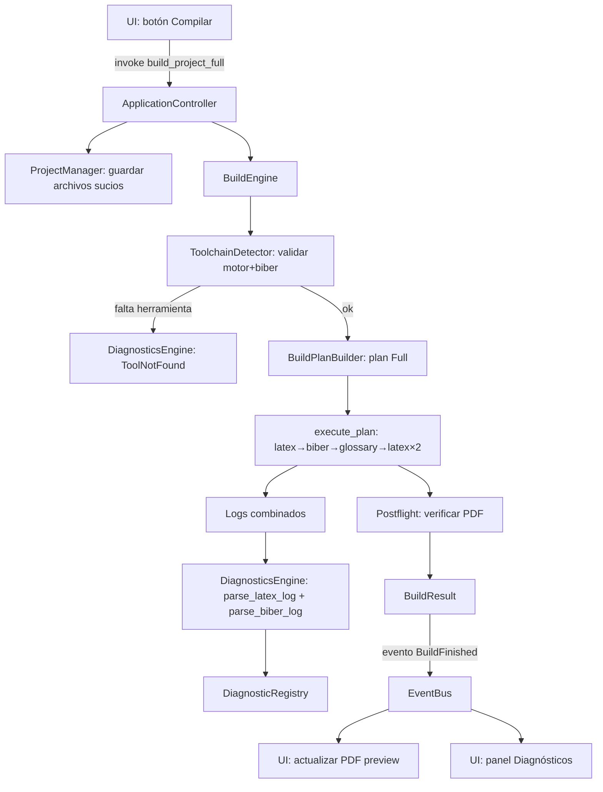
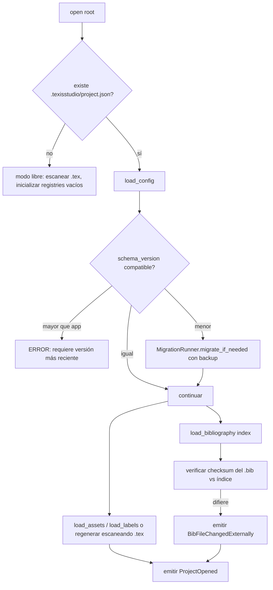
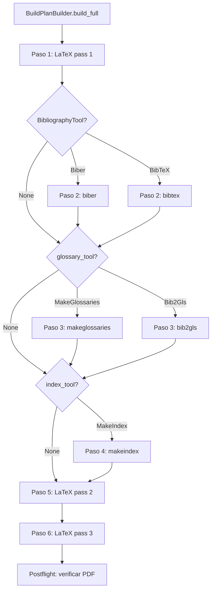
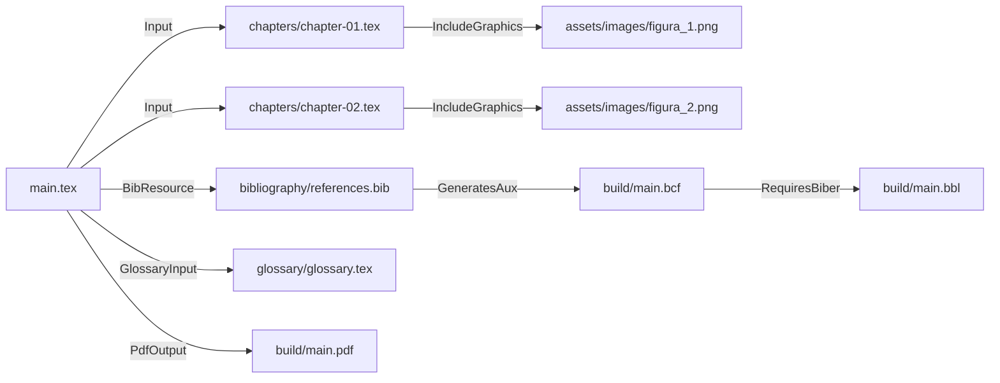

# TeXisStudio Master Specification v1.0

> **Estado:** Contrato técnico de implementación.
> **Fecha original:** 27 de mayo de 2026. **Última actualización:** 29 de mayo de 2026.
> **Audiencia:** desarrolladores e ingenieros (Rust/Tauri/React/Qt), revisores de arquitectura, agentes de implementación.
> **Propósito:** servir como fuente única de verdad para implementar TeXisStudio sin tener que inventar decisiones fundamentales.
>
> **Cambios en la actualización 2026-05-29:** §3.3 Tectonic como toolchain soportada y recomendada por defecto. §20.12-20.13 Tectonic como backend del BuildEngine, selector de backend en UI, resumen de compilación en terminal. §33.6 guía de instalación por OS. §25.5 AIEngine (asistente de IA integrado, multi-proveedor, seguridad por diseño). §35 autoevaluación actualizada. Objetivos de producto no negociables documentados al final del §35.

---

## Nota sobre el estado de implementación

Este documento no describe un sistema hipotético. Una parte sustancial ya está implementada en el monorepo:

- `texis-core` (Rust): 88 módulos. Incluye `bibliography/` (model, registry, merger, exporters, normalization, parser, formatter, validator), `build_engine/` (engine, plan, result, toolchain), `diagnostics/` (engine, model, registry), `texis_project/` (model, persistence, migrations), `dependency_graph.rs`, `events.rs`, `commands.rs`, `reference/`, `asset/`, `template_engine/`, `plugin/`, `security/`, `profile/`, `compiler/`, `exporter/`, `postflight/`, `validator/`, `generator/`, `system/`.
- `texis-app/src-tauri` (Rust): 13 módulos de comandos, incluyendo `doi`, `datacite`, `openalex`, `semantic_scholar`, `zotero`, `bibliography_unified`, `build`, `template`, `remote`, `compiler`, `project`, `system`.
- `texis-app/src` (TypeScript/React): servicios `spellcheck`, `languagePacks`, `vocabularyPacks`, `autocorrect`, `grammar`, `profileCatalog`.

Cada sección marca explícitamente qué está **implementado**, qué es **parcial** y qué es **especificado (pendiente)**. La sección final **Autoevaluación de completitud** consolida ese estado sin maquillarlo.

Documentos que este maestro consolida y eleva:

| Documento fuente | Contenido | Tratamiento aquí |
|---|---|---|
| `Auditoria_TeXisStudio_Roadmap_v2.2_2026-05-27.md` | Auditoría + expansión técnica | Integrado como base de estado y prioridades |
| `TeXisStudio_DMS_Technical_Spec_v1.0.md` | Assets, tablas, refs, glosarios, paquetes, estructura | Elevado a §15–§19, §12 |
| `TeXisStudio_Bibliography_System_Spec_v1.0.md` | Motor bibliográfico unificado | Elevado a §13 |
| `TeXisStudio_Master_Integration_Specification_v1.md` | Arquitectura, eventos, build, diagnósticos, UX, plugins, seguridad, testing, migraciones, templates | Elevado y reorganizado a lo largo del documento |

---

## Tabla de contenidos

1. Visión del producto
2. Filosofía y principios rectores
3. Alcance de la versión
4. Arquitectura global
5. Modelo canónico de proyecto
6. Estructura de carpetas del proyecto
7. Persistencia interna `.texisstudio/`
8. ProjectManager
9. WorkspaceManager
10. ProfileEngine
11. TemplateEngine
12. DocumentEngine
13. BibliographyEngine
14. DictionaryEngine
15. AssetEngine
16. TableEngine
17. ReferenceEngine
18. GlossaryEngine
19. PackageEngine
20. BuildEngine
21. DependencyGraph
22. DiagnosticsEngine
23. Command System
24. UI/UX Architecture
25. Editor Integration
26. Plugin Architecture
27. Seguridad
28. Privacidad
29. Interoperabilidad
30. Migraciones y versionado
31. Testing Strategy
32. Criterios de aceptación globales
33. Casos límite obligatorios
34. Apéndices técnicos
35. Autoevaluación de completitud

---

# 1. Visión del producto

TeXisStudio es una **capa profesional de administración documental sobre LaTeX** para escritura académica y técnica seria (tesis, artículos, libros, manuales, reportes). No reemplaza a LaTeX ni lo oculta: lo organiza, lo valida, automatiza sus partes incómodas y traduce su comportamiento a un modelo comprensible.

El usuario objetivo es alguien que produce documentos largos y formales —tesistas de posgrado, investigadores, autores técnicos— y que necesita garantías de corrección estructural, bibliográfica y editorial, sin convertirse en experto en la cadena de herramientas de TeX.

La promesa concreta del producto:

- **El documento siempre es LaTeX válido y portable.** Cualquier proyecto creado o editado en TeXisStudio compila fuera de la app con una instalación TeX estándar.
- **La app conoce el documento.** Sabe qué assets se usan, qué referencias están rotas, qué citas no tienen entrada en el `.bib`, qué paquetes faltan, qué errores de compilación significan en lenguaje humano.
- **La app no destruye el trabajo manual.** Respeta el código que el usuario escribió a mano; solo gestiona lo que declaró gestionar.
- **La app es honesta sobre la verificación.** Distingue entre "validado por reglas", "compilado con evidencia" y "verificado institucionalmente". No promete más de lo que comprueba.

## 1.1 Qué es y qué no es

| TeXisStudio **es** | TeXisStudio **no es** |
|---|---|
| Un administrador de proyecto LaTeX | Un reemplazo del motor LaTeX |
| Un validador estructural, bibliográfico y editorial | Un procesador de texto WYSIWYG que oculta el `.tex` |
| Un motor bibliográfico conectado a catálogos académicos | Una base de datos bibliográfica cerrada |
| Un traductor de errores de compilación | Un compilador propio |
| Una capa de automatización (assets, tablas, citas, glosarios) | Un formato propietario disfrazado de LaTeX |

## 1.2 Diferenciador central

El diferenciador no es "editar LaTeX más fácil" —eso ya existe—. Es que **la app mantiene un modelo semántico vivo del proyecto** (registries de assets, labels, referencias bibliográficas con procedencia, paquetes, glosarios) y usa ese modelo para prevenir errores antes de la compilación y para diagnosticar los que ocurren.

---

# 2. Filosofía y principios rectores

Principio central, que gobierna toda decisión de diseño:

> **LaTeX compone el documento. TeXisStudio administra el proyecto.**

De ahí se derivan diez principios vinculantes. Cualquier feature que los viole es un bug de diseño, no una decisión.

### P1 — LaTeX primero

La salida real es siempre LaTeX válido. La app puede generar bloques, pero el resultado debe ser código que un humano pueda leer, editar y compilar sin la app. **Decisión:** ningún formato intermedio propietario participa en la composición. Los metadatos propios viven en `.texisstudio/`, nunca dentro del `.tex`.

### P2 — Portabilidad absoluta

Ningún archivo `.tex`, `.bib` o `.sty` del proyecto contiene rutas absolutas. Toda referencia interna es relativa al root del proyecto. **Justificación:** un proyecto debe poder moverse de máquina, sincronizarse en nube y compilarse en CI sin reescritura.

### P3 — No destrucción del trabajo manual

La app modifica con cuidado. El contenido escrito a mano fuera de bloques explícitamente marcados como `AUTO-GENERATED` nunca se reescribe. Los archivos `chapters/*.tex`, `front/*.tex`, `back/*.tex` son territorio exclusivo del usuario; la app solo los lee para extraer labels, referencias y términos.

### P4 — Trazabilidad

Cada asset, tabla, cita, label o término de glosario sabe de dónde viene y dónde se usa. En bibliografía esto es estricto: se conserva el payload original de cada proveedor y la fuente de cada campo (provenance por campo).

### P5 — Preferir estándares

BibLaTeX/Biber, Hunspell, CSL, Crossref, DataCite, OpenAlex, Zotero, `graphicx`, `booktabs`, `tabularray`, `cleveref`, `glossaries`. **Decisión:** no se inventan formatos cuando existe un estándar académico consolidado.

### P6 — Operaciones atómicas o reversibles

Toda operación que toca múltiples archivos (renombrar un label, importar un asset, agregar un paquete) es atómica: se completa entera o no deja efectos. Las operaciones del usuario son reversibles vía el Command System (undo/redo).

### P7 — Seguridad por defecto

`shell-escape` desactivado por defecto. Descargas solo por HTTPS desde hosts en allowlist. Procesos externos solo desde una lista permitida. Tokens en el keychain del SO, nunca en texto plano.

### P8 — Privacidad por defecto

Sin telemetría externa salvo opt-in explícito. No se suben documentos. No se envía texto completo a servicios externos sin permiso por sesión.

### P9 — Honestidad de verificación

La app distingue estados de confianza y no los confunde en la UI ni en los artefactos de entrega: `validado por reglas` ≠ `compilado con evidencia` ≠ `verificado institucionalmente`. (Esta distinción ya está enforced en el sistema de perfiles vía la regla `POL_VERIFIED_NO_CI_EVIDENCE`.)

### P10 — El usuario es la autoridad final

Cuando un dato del usuario contradice un dato derivado (p. ej. editó el `.bib` a mano), la app **detecta** el cambio y lo **surface**, nunca lo silencia ni lo sobrescribe sin confirmación. En provenance bibliográfica, `UserManual` tiene la confianza máxima.

---

# 3. Alcance de la versión

## 3.1 Incluido en v1.0

| Dominio | Alcance v1.0 |
|---|---|
| Gestión de proyecto | `TexisProject` canónico, persistencia `.texisstudio/`, migraciones con backup |
| Perfiles | Motor de perfiles institucionales con validación de política (implementado) |
| Plantillas | 7 plantillas builtin, instanciación completa (implementado) |
| Bibliografía | Crossref + DataCite + OpenAlex + Semantic Scholar + Zotero, modelo interno, merger, exporters BibLaTeX/CSL-JSON/RIS (implementado) |
| Diccionarios | Hunspell vía nspell, packs de idioma y vocabulario, tokenizer LaTeX-aware (implementado) |
| Assets | Registry con checksum, normalización de nombres, verificación (implementado) |
| Referencias cruzadas | LabelRegistry, detección de duplicados/rotas/no usadas, renombrado atómico (implementado) |
| Compilación | BuildEngine con planes Full/Quick/Draft, toolchain detection, allowlist (implementado) |
| Diagnósticos | Mapeo de 15+ errores LaTeX y 4 de Biber a mensajes amigables (implementado) |
| Tablas | Especificado; backend de generación pendiente de implementación |
| Glosarios | Especificado; registry pendiente |
| Paquetes | Especificado; PackageEngine pendiente de implementación completa |
| UI/UX | Especificada; integración React/Tauri parcial |
| Plugins | Trait + registry implementados; plugins concretos pendientes |
| Exportación | Delivery package implementado (16 artefactos); Pandoc/EPUB pendientes |

## 3.2 Explícitamente fuera de v1.0

- Edición colaborativa en tiempo real.
- Sincronización en nube propia (la app funciona sobre carpetas sincronizadas por terceros, pero no implementa su propio backend).
- Gramática avanzada con IA local (LanguageTool queda como plugin opcional).
- Plugins de terceros cargados desde fuentes no confiables (la arquitectura los contempla, pero v1.0 solo carga plugins core).
- Editor visual de fórmulas matemáticas.

## 3.3 Plataformas objetivo

macOS (Apple Silicon e Intel), Windows 10/11, Linux (glibc).

Toolchains TeX soportadas:

| Toolchain | Plataformas | Notas |
|---|---|---|
| TeX Live / MacTeX | macOS, Linux, Windows | Distribución completa. Recomendada para tesis exigentes (física avanzada, matemáticas de posgrado, perfiles institucionales estrictos). |
| MiKTeX | Windows (nativo), macOS, Linux | Descarga paquetes bajo demanda. Buena opción en Windows. |
| Tectonic | macOS, Windows, Linux | Motor autónomo moderno. Descarga solo los paquetes necesarios. Cubre ~80% de las tesis sin instalación de gigabytes. Puede coexistir con TeX Live/MiKTeX en el mismo sistema. |

**Decisión de producto:** Tectonic es la opción recomendada por defecto para nuevos usuarios. TeX Live/MacTeX/MiKTeX se presentan como la opción para tesis de alta exigencia o cuando Tectonic no logra compilar un paquete específico. La app detecta todos los backends disponibles y permite al usuario elegir cuál usar desde la UI de compilación.

---

# 4. Arquitectura global

## 4.1 Capas

```text
┌──────────────────────────────────────────────────────────────────┐
│  UI Layer  (React + Tauri WebView / Qt en evaluación)            │
│  Paneles, editor, vista PDF, command palette, diálogos            │
└────────────────────────────┬─────────────────────────────────────┘
                             │ comandos (invoke) y eventos
┌────────────────────────────▼─────────────────────────────────────┐
│  Application Layer  (Tauri commands + ApplicationController)     │
│  Orquesta engines · despacha comandos · distribuye eventos        │
└───────┬──────────┬──────────┬──────────┬──────────┬─────────────┘
        │          │          │          │          │
┌───────▼──┐ ┌────▼───┐ ┌────▼───┐ ┌────▼───┐ ┌───▼──────────────┐
│ Project  │ │ Build  │ │ Diag   │ │Profile │ │ Document Engines  │
│ Manager  │ │ Engine │ │ Engine │ │ Engine │ │ Asset/Table/Ref/  │
│          │ │        │ │        │ │        │ │ Gloss/Package/Doc │
└───────┬──┘ └────┬───┘ └────┬───┘ └────┬───┘ └──────────────────┘
        │         │           │          │
┌───────▼─────────▼───────────▼──────────▼──────────────────────────┐
│  Domain Layer  (texis-core, lógica pura)                          │
│  BibliographyEngine · DictionaryEngine · TemplateEngine           │
│  Modelos puros · sin Qt · sin filesystem directo · sin HTTP        │
└───────────────────────────────┬───────────────────────────────────┘
                                │
┌───────────────────────────────▼───────────────────────────────────┐
│  Infrastructure Layer                                             │
│  Filesystem IO · ProcessRunner · HTTP clients · ProviderCache     │
├───────────────────────────────────────────────────────────────────┤
│  Persistence Layer    (.texisstudio/ readers/writers, atomic)     │
├───────────────────────────────────────────────────────────────────┤
│  Integration Layer    (Crossref/DataCite/OpenAlex/S2/Zotero/TeX)  │
└───────────────────────────────────────────────────────────────────┘
```

## 4.2 Reglas de dependencia (vinculantes)

```text
UI Layer          → puede llamar Application Layer. NADA más.
Application Layer → coordina Domain Layer; puede llamar Infrastructure.
Domain Layer      → NO conoce Qt/React. NO usa reqwest/tokio directo.
                    NO accede a rutas absolutas del sistema sin abstracción.
                    Define traits que Infrastructure implementa.
Infrastructure    → implementa IO, red, procesos, almacenamiento.
                    NO contiene lógica de negocio.
Persistence       → serializa/deserializa estado. Escritura atómica.
Integration       → clientes de APIs externas y de la toolchain TeX.
```

Prohibiciones que el revisor de código debe hacer cumplir:

- `texis-core` (Domain) **no** importa `tauri`, `reqwest`, ni `qt`.
- Los clientes HTTP de proveedores bibliográficos viven en `texis-app/src-tauri/src/commands/` (Application/Integration), **no** en `texis-core`. Por eso `DataCiteClient`, `OpenAlexClient`, etc. están en la app y retornan `BibliographicRecord` (tipo del Domain) que sí vive en el core.
- La UI **no** accede a Infrastructure directamente; todo pasa por comandos.

> **Decisión de diseño justificada:** se eligió ubicar los clientes HTTP en la capa de aplicación Tauri en lugar de en el core porque (a) mantiene el core compilable y testeable sin red, (b) Tauri ya gestiona el runtime async (`tokio`), y (c) los modelos de dominio (`BibliographicRecord`, `RecordMerger`) viven en el core y son compartidos. El precio es que el core no puede orquestar una resolución de DOI por sí solo; lo hace el comando `import_doi_unified`. Se acepta este precio.

## 4.3 Engines y responsabilidades

```rust
pub struct TeXisStudioApplication {
    pub project_manager:     ProjectManager,
    pub workspace_manager:   WorkspaceManager,
    pub document_engine:     DocumentEngine,
    pub bibliography_engine: BibliographyEngine,
    pub dictionary_engine:   DictionaryEngine,
    pub asset_engine:        AssetEngine,
    pub table_engine:        TableEngine,
    pub reference_engine:    ReferenceEngine,
    pub glossary_engine:     GlossaryEngine,
    pub package_engine:      PackageEngine,
    pub build_engine:        BuildEngine,
    pub diagnostics_engine:  DiagnosticsEngine,
    pub profile_engine:      ProfileEngine,
    pub template_engine:     TemplateEngine,
    pub export_engine:       ExportEngine,
    pub plugin_manager:      PluginManager,
    pub event_bus:           EventBus,
    pub command_dispatcher:  CommandDispatcher,
}
```

| Engine | Posee | Solo consulta | Emite eventos |
|---|---|---|---|
| ProjectManager | `TexisProject`, registries, config | — | `ProjectOpened/Closed/Modified` |
| WorkspaceManager | estado de UI, paneles, historial | — | `WorkspaceStateChanged` |
| DocumentEngine | estructura documental, `main.tex` generado | Asset/Label registries | `StructureChanged` |
| BibliographyEngine | `BibliographyRegistry`, provider cache | PackageRegistry | `RecordAdded/Updated`, `BibFileChanged` |
| DictionaryEngine | packs instalados, custom words | — | `DictionaryChanged` |
| AssetEngine | `AssetRegistry` | — | `AssetImported/Missing/Moved` |
| TableEngine | `TableModel` activo | PackageRegistry | `TableInserted/Updated` |
| ReferenceEngine | `LabelRegistry` | — | `LabelCreated/Renamed`, `BrokenRefDetected` |
| GlossaryEngine | `GlossaryRegistry` | PackageRegistry | `EntryAdded`, `GlossaryFileUpdated` |
| PackageEngine | `PackageRegistry` | — | `PackageAdded`, `ConflictDetected` |
| BuildEngine | `BuildPlan`, `BuildResult`, logs | todos los registries | `BuildStarted/Finished/Failed` |
| DiagnosticsEngine | `DiagnosticRegistry` | varios registries | `DiagnosticsUpdated` |
| ProfileEngine | perfiles instalados | — | `ProfileChanged` |
| TemplateEngine | plantillas | ProfileEngine | — |
| ExportEngine | — | todos los registries | `ExportCompleted` |
| PluginManager | plugins registrados | — | `PluginLoaded/Error` |

**Coordinador transversal:** `ApplicationController` orquesta operaciones que cruzan engines (compilar, cambiar perfil, exportar, validar proyecto completo). Los engines independientes (p. ej. Bibliography ↔ Dictionary) **no** se llaman directamente: se comunican por `EventBus`.

## 4.4 Diagrama de flujo de una operación transversal: compilar



---

# 5. Modelo canónico de proyecto

**Estado: implementado** en `texis-core/src/texis_project/model.rs`.

## 5.1 Propósito

`TexisProject` es la entidad central. Reúne toda la información viva de un proyecto: identidad, ruta, perfil, metadatos, configuración de build, los registries derivados y el estado de UI. Es el agregado raíz del dominio.

## 5.2 Entidad principal

```rust
pub struct TexisProject {
    pub id: ProjectId,                  // Uuid
    pub schema_version: SchemaVersion,  // {major, minor, patch}, CURRENT = 1.0.0
    pub root_path: PathBuf,             // absoluta en disco
    pub root_file: PathBuf,             // relativa: "main.tex"
    pub project_file: PathBuf,          // root/.texisstudio/project.json
    pub profile: Option<DocumentProfileRef>,
    pub metadata: ProjectMetadata,
    pub build_config: BuildConfig,
    pub registries: ProjectRegistries,
    pub workspace_state: WorkspaceState,
    pub created_at: DateTime<Utc>,
    pub modified_at: DateTime<Utc>,
}

pub struct ProjectRegistries {
    pub assets: AssetRegistry,
    pub bibliography: BibliographyRegistry,
    pub labels: LabelRegistry,
    // glossary y packages se incorporan al completar GlossaryEngine/PackageEngine
}

pub struct BuildConfig {
    pub engine: LatexEngine,            // PdfLatex | XeLatex | LuaLatex (default XeLatex)
    pub bibliography_tool: BibliographyTool, // Biber (default) | BibTeX | None
    pub glossary_tool: Option<GlossaryTool>, // MakeGlossaries | Bib2Gls
    pub index_tool: Option<IndexTool>,       // MakeIndex | Xindy
    pub output_dir: PathBuf,            // "build"
    pub clean_on_build: bool,
    pub draft_mode: bool,
    pub shell_escape: bool,             // SIEMPRE false por defecto
    pub synctex: bool,                  // true por defecto
}
```

## 5.3 Fuente de verdad, caché y regenerable

La distinción es crítica y define qué se puede borrar sin pérdida.

| Categoría | Qué incluye | Regla |
|---|---|---|
| **Fuente de verdad primaria (usuario)** | `.tex`, `.bib`, `.sty`, assets | Nunca se regenera. El usuario es dueño. |
| **Fuente de verdad de la app** | `project.json`, `bibliography-index.json` | La app es dueña. `bibliography-index.json` NO es regenerable (contiene provenance y `raw_payload`). |
| **Regenerable** | `label-registry.json`, `asset-index.json`, `package-registry.json`, `glossary-registry.json` | Reconstruible escaneando los `.tex`. |
| **Caché (descartable)** | `cache/bibliography/`, `cache/dictionaries/`, `cache/previews/`, `cache/diagnostics/`, `build/` | Borrable sin pérdida. Se regenera bajo demanda. |

**Invariante I-PROJ-1:** borrar `.texisstudio/cache/` completo nunca corrompe el proyecto ni pierde datos críticos.

**Invariante I-PROJ-2:** borrar `.texisstudio/` entero deja el documento fuente intacto y compilable.

## 5.4 Versión serializable

`project.json` no almacena los registries (van en archivos separados) ni `workspace_state` (va en `workspace.json`). Se usa `ProjectConfig`:

```rust
pub struct ProjectConfig {
    pub id: ProjectId,
    pub schema_version: SchemaVersion,
    pub root_file: PathBuf,
    pub profile: Option<DocumentProfileRef>,
    pub metadata: ProjectMetadata,
    pub build_config: BuildConfig,
    pub created_at: DateTime<Utc>,
    pub modified_at: DateTime<Utc>,
}
```

## 5.5 Invariantes del modelo

- **I-PROJ-3:** `schema_version.major` distinto al de la app ⇒ no abrir si es mayor; migrar si es menor (ver §30).
- **I-PROJ-4:** `build_config.shell_escape == false` salvo activación explícita confirmada por el usuario (test que lo verifica: `build_config_default_shell_escape_is_false`).
- **I-PROJ-5:** `root_file` siempre relativo a `root_path`.

## 5.6 Criterios de aceptación

| ID | Criterio |
|---|---|
| AC-PROJ-1 | `ProjectConfig` serializa/deserializa sin pérdida (round-trip). |
| AC-PROJ-2 | Un proyecto con `schema_version` mayor a `CURRENT` se rechaza con error claro. |
| AC-PROJ-3 | `texisstudio_dir()`, `build_dir()`, `root_file_abs()` devuelven rutas correctas. |

---

# 6. Estructura de carpetas del proyecto

**Estado: implementado** (generación por TemplateEngine, ver §11).

```text
project-root/
├─ main.tex                 ← raíz; solo \input y configuración (gestionado por la app)
├─ preamble.tex             ← \usepackage globales (la app añade, no elimina)
├─ metadata.tex             ← título, autor, fecha (gestionado por la app)
│
├─ front/                   ← front matter (territorio del usuario)
│  ├─ portada.tex
│  ├─ dedicatoria.tex
│  ├─ agradecimientos.tex
│  ├─ resumen.tex
│  └─ abstract.tex
│
├─ chapters/                ← cuerpo (territorio del usuario)
│  ├─ chapter-01-introduccion.tex
│  └─ ...
│
├─ back/                    ← apéndices (territorio del usuario)
│  └─ apendice-a.tex
│
├─ assets/
│  ├─ images/
│  ├─ tables/
│  ├─ diagrams/
│  └─ pdfs/
│
├─ bibliography/
│  └─ references.bib
│
├─ glossary/
│  └─ glossary.tex          ← bloque AUTO-GENERATED gestionado; resto del usuario
│
├─ build/                   ← salida de compilación (ignorado por Git y por sync)
│  └─ main.pdf
│
└─ .texisstudio/            ← metadatos internos (ver §7)
```

**Regla de convivencia (P3):** la app crea esta estructura por convención, pero acepta proyectos que no la sigan. Un proyecto importado con estructura arbitraria se abre en "modo libre" (todas las funciones disponibles, sin gestión automática de estructura). Ver §33 (caso límite: proyecto manual).

`.gitignore` recomendado (generado por la app; ya implementado en `ProjectPersistence::recommended_gitignore`):

```gitignore
build/
.texisstudio/workspace.json
.texisstudio/cache/
.texisstudio/logs/
*.aux
*.log
*.bcf
*.blg
*.bbl
*.out
*.toc
*.lof
*.lot
*.glo
*.gls
*.glg
*.ist
*.acn
*.acr
*.alg
*.run.xml
*.synctex.gz
*.fdb_latexmk
*.fls
```

---

# 7. Persistencia interna `.texisstudio/`

**Estado: implementado** en `texis-core/src/texis_project/persistence.rs`.

## 7.1 Estructura

```text
.texisstudio/
├─ project.json                     ← ProjectConfig
├─ workspace.json                   ← WorkspaceState (UI)
├─ registries/
│  ├─ asset-index.json
│  ├─ label-registry.json
│  └─ bibliography-index.json
├─ cache/
│  ├─ bibliography/                 ← payloads de proveedores por DOI
│  ├─ dictionaries/                 ← .aff/.dic descargados
│  ├─ diagnostics/
│  └─ previews/
├─ migrations/
│  ├─ applied.json
│  └─ backup_<timestamp>/           ← backups pre-migración
└─ logs/
   └─ texisstudio.log
```

## 7.2 Especificación archivo por archivo

| Archivo | Propósito | Dueño | Crítico | Caché | ¿Borrable? | Cuándo se escribe | Git |
|---|---|---|---|---|---|---|---|
| `project.json` | Configuración central | App | ✅ Sí | No | No | Al cambiar config/metadatos | Incluir |
| `workspace.json` | Estado de UI (archivos abiertos, zoom, último build) | App | No | No | Sí (se reinicia) | Al cerrar/cambiar UI | Excluir |
| `registries/asset-index.json` | Índice de assets | App | Parcial | No | Sí (regenerable) | Al cambiar `.tex` o importar | Opcional |
| `registries/label-registry.json` | Labels y referencias | App | Parcial | No | Sí (regenerable) | Al guardar `.tex` | Opcional |
| `registries/bibliography-index.json` | Records con provenance + raw_payload | App | ✅ Sí | No | **No** (no regenerable) | Al agregar/editar referencia | Incluir (recomendado) |
| `cache/bibliography/*.json` | Payload por DOI con TTL | App | No | ✅ Sí | Sí | Tras consulta exitosa | Excluir |
| `cache/dictionaries/*` | `.aff`/`.dic` descargados | App | No | ✅ Sí | Sí | Tras descarga de pack | Excluir |
| `cache/previews/*` | Thumbnails de assets | App | No | ✅ Sí | Sí | Al previsualizar | Excluir |
| `cache/diagnostics/*` | Último diagnóstico por archivo | App | No | ✅ Sí | Sí | Tras validación | Excluir |
| `migrations/applied.json` | Historial de migraciones | App | ✅ Sí | No | No | Al migrar | Incluir |
| `migrations/backup_*/` | Backup pre-migración | App | ✅ Sí (temporal) | No | Sí (tras confirmar) | Antes de migrar | Excluir |
| `logs/texisstudio.log` | Log de operaciones de la app | App | No | No | Sí | Siempre | Excluir |

## 7.3 Garantías de escritura

**Escritura atómica obligatoria** para todo archivo crítico: escribir a `<archivo>.tmp`, luego `rename`. Implementado en `atomic_write()`. Justificación: un crash a mitad de escritura nunca deja un `project.json` corrupto.

**El log NO contiene contenido del documento** ni texto del usuario ni respuestas completas de APIs. Solo operaciones, errores internos y advertencias. Rotación: 10 archivos de máx. 1 MB. (Ver §27.)

## 7.4 Caché de proveedores: TTL

```text
Crossref:         30 días   (metadatos de artículos son estables)
DataCite:         30 días
OpenAlex:          7 días   (citation_count cambia)
SemanticScholar:   7 días
```

Implementado: `get_bib_cache` verifica TTL y retorna `None` si expiró; `set_bib_cache(doi, provider, payload, ttl_days)`; `clear_cache()` recrea el directorio vacío.

## 7.5 Invariantes

- **I-PERS-1:** `bibliography-index.json` sobrevive a `clear_cache()` (test: `clear_cache_does_not_break_project`).
- **I-PERS-2:** todo nombre de archivo de caché de DOI es seguro para el filesystem (`doi_to_filename`: reemplaza `/` por `_`).
- **I-PERS-3:** ningún archivo en `.texisstudio/` contiene contenido fuente del documento.

## 7.6 Criterios de aceptación

| ID | Criterio |
|---|---|
| AC-PERS-1 | `save_config`/`load_config` round-trip preserva metadatos. |
| AC-PERS-2 | `load_workspace` devuelve `WorkspaceState::default()` si falta el archivo (no falla). |
| AC-PERS-3 | Cache miss cuando el TTL expiró o el archivo no existe. |
| AC-PERS-4 | `init_dirs` crea toda la estructura idempotentemente. |

---

# 8. ProjectManager

**Estado: parcial** (modelo y persistencia implementados; orquestación de ciclo de vida pendiente de cableado completo).

## 8.1 Propósito y problema real

El `ProjectManager` es el dueño del agregado `TexisProject` en memoria durante una sesión. Resuelve el problema de coordinar la apertura, carga de registries, detección de cambios externos y guardado coherente de un proyecto que vive parcialmente en disco (`.tex`, `.bib`) y parcialmente en metadatos (`.texisstudio/`).

## 8.2 Responsabilidades

- Abrir un proyecto: cargar `ProjectConfig`, reconstruir/leer registries, ejecutar migraciones si el schema es antiguo.
- Crear un proyecto: delegar al `TemplateEngine` (§11) y registrar el resultado.
- Guardar: persistir `project.json`, los registries y `workspace.json` de forma atómica.
- Detectar cambios externos: comparar checksums de `.bib` y `.tex` contra el último estado conocido.
- Cerrar: flush de estado, liberar recursos, emitir `ProjectClosed`.

## 8.3 Lo que NO debe hacer

- No compila (eso es BuildEngine).
- No parsea contenido LaTeX para validación semántica (eso es responsabilidad de Reference/Asset/Package engines mediante scan).
- No toca archivos del usuario fuera de `main.tex`/`preamble.tex`/`metadata.tex`.

## 8.4 Interfaz sugerida

```rust
pub struct ProjectManager {
    current: Option<TexisProject>,
    persistence: ProjectPersistence,
}

impl ProjectManager {
    pub fn open(&mut self, root: &Path) -> CoreResult<&TexisProject>;
    pub fn create_from_template(&mut self, template_id: &str, dest: &Path, meta: ProjectMetadata) -> CoreResult<&TexisProject>;
    pub fn save(&mut self) -> CoreResult<()>;
    pub fn close(&mut self) -> CoreResult<()>;
    pub fn detect_external_changes(&self) -> Vec<ExternalChange>;
    pub fn current(&self) -> Option<&TexisProject>;
    pub fn current_mut(&mut self) -> Option<&mut TexisProject>;
}

pub enum ExternalChange {
    BibFileModified { path: PathBuf },
    TexFileModified { path: PathBuf },
    AssetMissing { path: PathBuf },
    MainTexEditedManually,
}
```

## 8.5 Flujo de apertura



## 8.6 Flujos de error

| Error | Comportamiento |
|---|---|
| `project.json` corrupto | Intentar leer backup más reciente en `migrations/backup_*`; si no, ofrecer reconstruir en modo libre. |
| Schema mayor que la app | Rechazar apertura con mensaje accionable (actualizar la app). |
| `root_file` declarado no existe | Preguntar al usuario cuál es el archivo raíz. |
| Migración falla | Restaurar backup automáticamente (ver §30) y reportar el paso que falló. |

## 8.7 Validaciones e invariantes

- **I-PM-1:** nunca hay dos proyectos abiertos simultáneamente en el mismo `ProjectManager` (v1.0 es single-project por ventana).
- **I-PM-2:** `save()` es atómico por archivo; un crash a mitad no deja `project.json` corrupto.
- **I-PM-3:** abrir un proyecto en modo libre nunca crea `.texisstudio/` sin confirmación si el usuario solo quería inspeccionar.

## 8.8 Integraciones

- **UI:** comandos `open_project`, `create_project_from_template` (implementado), `save_project`, `close_project`.
- **BuildEngine:** le entrega `&TexisProject` para construir el plan.
- **DiagnosticsEngine:** tras `detect_external_changes`, alimenta diagnósticos informativos.
- **EventBus:** emite `ProjectOpened/Closed/Modified`.

## 8.9 Testing

- Apertura de proyecto válido restaura metadatos.
- Apertura de proyecto sin `.texisstudio/` entra en modo libre sin fallar.
- `save` + reapertura preserva estado.
- Detección de `.bib` modificado externamente.

## 8.10 Criterios de aceptación

| ID | Criterio |
|---|---|
| AC-PM-1 | Un proyecto creado por la app reabre con metadatos idénticos. |
| AC-PM-2 | Un proyecto con schema menor migra automáticamente con backup previo. |
| AC-PM-3 | Borrar `.texisstudio/` y reabrir reconstruye los registries regenerables sin pérdida del documento. |

---

# 9. WorkspaceManager

**Estado: especificado** (modelo `WorkspaceState` implementado; gestión pendiente).

## 9.1 Propósito

Gestiona el estado **efímero de UI** que mejora la experiencia pero nunca es crítico: qué archivos están abiertos, cuál está activo, posiciones de cursor, nivel de zoom, layout de paneles, resumen del último build. Se guarda en `workspace.json` (excluido de Git, descartable).

## 9.2 Modelo

```rust
pub struct WorkspaceState {
    pub open_files: Vec<PathBuf>,
    pub active_file: Option<PathBuf>,
    pub zoom_level: f32,
    pub last_build_summary: Option<BuildSummary>,
    pub editor_cursor_positions: HashMap<String, CursorPosition>, // path → línea/columna
}
```

## 9.3 Reglas

- **I-WS-1:** la pérdida de `workspace.json` nunca afecta la integridad del documento; al faltar, se usa `WorkspaceState::default()`.
- Las rutas absolutas en `open_files` se invalidan si el proyecto se mueve de máquina; el WorkspaceManager las descarta silenciosamente al restaurar (ver §33, caso "proyecto movido").

## 9.4 Criterios de aceptación

| ID | Criterio |
|---|---|
| AC-WS-1 | Reabrir un proyecto restaura archivos abiertos y posiciones de cursor cuando las rutas siguen siendo válidas. |
| AC-WS-2 | Rutas inválidas tras mover el proyecto se descartan sin error. |

---

# 10. ProfileEngine

**Estado: implementado** en `texis-core/src/profile/` (loader, model, policy, lock, registry) y `bin/validate_profile_repo.rs`.

## 10.1 Propósito y problema real

Un **perfil** es el conjunto de **reglas** de un tipo de documento institucional: qué secciones son obligatorias, qué motor LaTeX usar, qué estilo bibliográfico, qué paquetes incluir, qué exige la institución (márgenes, interlineado, portada). Resuelve el problema de que cada universidad/revista impone requisitos formales que el autor desconoce o incumple.

**Distinción fundamental (ya enforced):**

> Perfil = **reglas**. Plantilla = **estructura inicial concreta**. (Ver §11.)

## 10.2 Responsabilidades

- Cargar y validar perfiles (`profile.yaml`) contra el schema versionado.
- Aplicar política institucional (`ProfilePolicyValidator`).
- Mantener `profile.lock.yaml` como protección semántica (hash de las reglas aplicadas).
- Distinguir estados de confianza: `draft`, `reviewed`, `verified` — y enforcear que `verified` requiere evidencia de CI (`POL_VERIFIED_NO_CI_EVIDENCE`).

## 10.3 Lo que NO debe hacer

- No genera la estructura de archivos (eso es TemplateEngine).
- No declara un perfil `verified` sin `ci_evidence` (regla de política).
- No mezcla `reviewed` con `verified_*` (drift semántico prohibido).

## 10.4 Modelo (resumen, ya implementado)

```rust
pub struct Profile {
    pub id: String,
    pub name: String,
    pub version: String,
    pub schema_version: String,
    pub latex_engine: String,
    pub bibliography_backend: String,
    pub bibliography_style: String,
    pub document_class: DocumentClass,
    pub sections: Vec<ProfileSection>,
    pub page_layout: Option<PageLayout>,
    pub verification: ProfileVerification, // draft | reviewed | verified + ci_evidence
    pub license: Option<String>,
    pub author: Option<String>,
    pub tags: Vec<String>,
}
```

**Decisión vinculante (del estado del proyecto):** no usar `..Default::default()` para `Profile`; usar `Profile::new_draft()`. `schema_version` lo asigna el caller después. `abstract` y `abstract_en` son IDs distintos, nunca alias.

## 10.5 Integración

- **TemplateEngine:** una plantilla declara `compatible_profiles`. Al crear proyecto se sugiere el perfil.
- **DocumentEngine:** el perfil determina qué secciones obligatorias deben existir.
- **PackageEngine:** el perfil aporta paquetes requeridos.
- **DiagnosticsEngine:** `ProfileValidator` produce diagnósticos (sección faltante, abstract sin idioma requerido, falta declaración de originalidad).
- **ExportEngine:** el `policy_report.json` y `profile.lock.yaml` se incluyen en el delivery package.

## 10.6 Criterios de aceptación

| ID | Criterio |
|---|---|
| AC-PROF-1 | Un perfil sin `ci_evidence` no puede marcarse `verified` (regla `POL_VERIFIED_NO_CI_EVIDENCE`). |
| AC-PROF-2 | `profile.lock.yaml` detecta si las reglas aplicadas cambiaron respecto a lo bloqueado. |
| AC-PROF-3 | El validador de repo de perfiles (`validate_profile_repo`) rechaza perfiles con campos faltantes. |

---

# 11. TemplateEngine

**Estado: implementado** en `texis-core/src/template_engine/` (model, builtin, engine) + comando `create_project_from_template`.

## 11.1 Propósito y problema real

Resuelve el arranque en frío: un usuario que quiere "una tesis en español" no debería partir de un `.tex` en blanco. El TemplateEngine instancia una **estructura inicial concreta** —carpetas, `main.tex` con front/main/back matter, `preamble.tex` con paquetes, placeholders con comentarios orientativos, `.gitignore`, `.texisstudio/`—.

## 11.2 Plantillas builtin (7)

`thesis_es`, `thesis_en`, `article_academic`, `book`, `technical_manual`, `professional_report`, `cv`.

## 11.3 Modelo

```rust
pub struct ProjectTemplate {
    pub id: TemplateId,
    pub name: String,
    pub description: String,
    pub version: String,
    pub document_type: DocumentTypeHint,
    pub compatible_profiles: Vec<String>,
    pub required_files: Vec<TemplateFile>,
    pub default_metadata: ProjectMetadataTemplate,
    pub default_build_config: TemplateBuildConfig,
    pub default_packages: Vec<String>,
}

pub enum TemplateContent {
    Static(String),
    Generated { generator: GeneratorKind }, // MainTex | PreambleTex | MetadataTex | BibFile | GlossaryFile
    Placeholder { hint: String },
}

pub struct TemplateFile {
    pub relative_path: PathBuf,
    pub content: TemplateContent,
    pub is_app_managed: bool, // false = la app NUNCA lo toca tras crearlo
}
```

## 11.4 Flujo de instanciación

1. Crear carpetas del proyecto.
2. Para cada `TemplateFile`: `Static` → escribir; `Generated` → generar (main.tex con `\frontmatter/\mainmatter/\backmatter`, `\printbibliography`, `\printglossary` según corresponda); `Placeholder` → archivo con comentario orientativo.
3. `init_dirs()` de `.texisstudio/`.
4. Crear `.gitignore` si no existe.
5. Construir `TexisProject`, asignar perfil compatible, persistir `project.json`.

## 11.5 Distinción perfil vs plantilla (regla)

```text
Perfil    = reglas (validación, política, qué es obligatorio).
Plantilla = estructura inicial (archivos, carpetas, paquetes).
Una plantilla declara con qué perfiles es compatible.
Un perfil puede tener 0..N plantillas compatibles.
```

## 11.6 Preservación ante actualización de plantilla

Al actualizar una plantilla, los proyectos existentes **no se tocan automáticamente**. Si el usuario acepta actualizar, solo se tocan archivos `is_app_managed == true`; los modificados por el usuario reciben un diff para revisión manual.

## 11.7 Invariantes y criterios de aceptación

- **I-TPL-1:** toda plantilla builtin tiene `main.tex` (test: `all_builtin_templates_have_main_tex`).
- **I-TPL-2:** el `BuildConfig` derivado de una plantilla tiene `shell_escape == false`.

| ID | Criterio |
|---|---|
| AC-TPL-1 | Instanciar `thesis_es` crea `main.tex`, `preamble.tex`, `metadata.tex`, `.gitignore`, `.texisstudio/project.json`, `bibliography/references.bib`. |
| AC-TPL-2 | `metadata.tex` contiene el título y autor provistos. |
| AC-TPL-3 | `main.tex` contiene `\printbibliography` cuando la plantilla tiene `.bib`. |

---

# 12. DocumentEngine

**Estado: parcial** (generación de `main.tex` vía TemplateEngine implementada; gestión estructural viva pendiente).

## 12.1 Propósito y problema real

Mantiene el modelo de **estructura documental**: front matter, main matter, back matter, y la coherencia del `main.tex` raíz con los archivos que existen. Resuelve que en documentos largos el usuario pierde control de qué se incluye, en qué orden, y si `main.tex` quedó desincronizado de los archivos reales.

## 12.2 Responsabilidades

- Generar y mantener `main.tex` (gestionado por la app).
- Reflejar la estructura como árbol navegable (para el panel Structure de la UI).
- Detectar si `main.tex` fue editado manualmente y ofrecer resincronizar.
- Añadir paquetes necesarios a `preamble.tex` (sin eliminar los del usuario).

## 12.3 Lo que NO debe hacer

- No reescribe `chapters/*.tex` ni `front/*.tex` ni `back/*.tex`.
- No reescribe agresivamente `main.tex` si el usuario lo editó: pregunta primero.

## 12.4 Modelo

```rust
pub struct DocumentStructure {
    pub front_matter: Vec<FrontMatterBlock>,
    pub main_matter: Vec<MainMatterBlock>,
    pub back_matter: Vec<BackMatterBlock>,
}

pub enum MainMatterBlock {
    Chapter { file: PathBuf, title: String, number: Option<u32> },
    Part { title: String, chapters: Vec<MainMatterBlock> },
}

pub enum BackMatterBlock {
    Bibliography,
    Appendix { file: PathBuf, title: String, label: String },
    Glossary, Acronyms, Symbols, Index,
}
```

## 12.5 Convivencia con código manual (P3)

`main.tex` es gestionado pero visible; si el usuario lo edita, el DocumentEngine detecta el cambio (checksum) y pregunta si resincronizar la estructura. `preamble.tex`: la app puede **añadir** `\usepackage` (con comentario `% añadido por TeXisStudio`), nunca **eliminar** líneas del usuario.

## 12.6 Integración y criterios de aceptación

- **PackageEngine:** la estructura determina qué paquetes son necesarios (p. ej. `glossaries` si hay glosario).
- **ReferenceEngine:** la estructura aporta los títulos para `display_name` de labels de capítulo/sección.

| ID | Criterio |
|---|---|
| AC-DOC-1 | `main.tex` generado compila con `latexmk` fuera de la app. |
| AC-DOC-2 | Editar `main.tex` a mano y reabrir no pierde los cambios del usuario. |
| AC-DOC-3 | Añadir un capítulo actualiza `main.tex` preservando el orden y los `\input` existentes. |

---

# 13. BibliographyEngine

**Estado: implementado** — `texis-core/src/bibliography/` + `texis-app/src-tauri/src/commands/bibliography_unified.rs` y providers individuales.

## 13.1 Propósito y problema real

LaTeX puede incluir bibliografía. El problema no es técnico: es operativo. El usuario pega un DOI, recibe un BibTeX copiado de Google Scholar (que puede estar incompleto, mal formateado o con entidades HTML), lo pega en el `.bib`, y reza para que Biber no se queje. TeXisStudio resuelve: **buscar, recuperar, normalizar, validar, fusionar, exportar a BibLaTeX y citar en LaTeX** — todo desde un modelo interno propio.

**Decisión arquitectónica central:** BibTeX/BibLaTeX no es el modelo interno. Es un formato de salida. El modelo interno es `BibliographicRecord`. Esto permite fusionar datos de múltiples proveedores, rastrear la procedencia campo por campo y exportar a múltiples formatos (BibLaTeX, CSL-JSON, RIS) sin perder información.

## 13.2 Responsabilidades

- Resolver DOIs a `BibliographicRecord` usando Crossref + DataCite + OpenAlex + Semantic Scholar.
- Integrar con Zotero BBT local.
- Fusionar datos de múltiples proveedores con prioridad por campo y tracking de provenance.
- Detectar duplicados por DOI, ISBN o similitud de título+autores.
- Generar y gestionar citation keys únicas.
- Escribir y sincronizar `references.bib`.
- Mantener `BibliographyRegistry` como índice persistente (no regenerable).
- Exportar a BibLaTeX, CSL-JSON, RIS.
- Producir diagnósticos: citas sin entrada, duplicados, DOI inválido, Biber pendiente.

## 13.3 Lo que NO debe hacer

- No ejecuta Biber (eso es BuildEngine).
- No almacena el `.bib` como fuente de verdad de provenance (eso está en `bibliography-index.json`).
- No asume que BibTeX es el modelo interno.

## 13.4 Modelo de datos

### BibliographicRecord (ya implementado)

```rust
pub struct BibliographicRecord {
    pub id: BibliographicRecordId,   // Uuid
    pub cite_key: String,
    pub record_type: RecordType,     // Article|Book|BookChapter|ConferencePaper|Thesis|Dataset|...
    pub title: Option<String>,
    pub subtitle: Option<String>,
    pub authors: Vec<PersonName>,
    pub editors: Vec<PersonName>,
    pub year: Option<i32>,
    pub date: Option<NaiveDate>,
    pub doi: Option<String>,         // normalizado: "10.xxxx/yyyy" sin prefijo URL
    pub isbn: Option<String>,        // normalizado: sin guiones
    pub issn: Option<String>,
    pub url: Option<String>,
    pub publisher: Option<String>,
    pub journal: Option<String>,
    pub booktitle: Option<String>,
    pub institution: Option<String>,
    pub volume: Option<String>,
    pub issue: Option<String>,
    pub pages: Option<String>,
    pub language: Option<String>,    // BCP-47
    pub abstract_text: Option<String>,
    pub keywords: Vec<String>,
    pub license: Option<String>,
    pub citation_count: Option<u32>,
    pub provenance: RecordProvenance,
    pub created_at: DateTime<Utc>,
    pub updated_at: DateTime<Utc>,
}

pub struct RecordProvenance {
    pub field_sources: HashMap<String, FieldSource>,  // campo → {provider, fetched_at}
    pub raw_payloads: HashMap<String, serde_json::Value>, // provider → payload original
    pub confidence_score: f32,        // 0.0–1.0
    pub primary_provider: Option<String>,
    pub fetched_at: HashMap<String, DateTime<Utc>>,
}
```

**Invariantes:**
- **I-BIB-1:** `doi` siempre sin prefijo URL (`10.xxx/yyy`).
- **I-BIB-2:** `isbn` sin guiones.
- **I-BIB-3:** `cite_key` único en el proyecto. Sufijo `b,c,...` ante colisión.
- **I-BIB-4:** `raw_provider_payload` se conserva aunque el usuario edite el `.bib` manualmente.

### BibliographyRegistry (ya implementado)

```rust
pub struct BibliographyRegistry {
    records: HashMap<BibliographicRecordId, BibliographicRecord>,
    by_cite_key: HashMap<String, BibliographicRecordId>,
    by_doi: HashMap<String, BibliographicRecordId>,
    by_isbn: HashMap<String, BibliographicRecordId>,
}
```

## 13.5 Arquitectura de providers

```text
BibliographyEngine
 ├─ CrossrefClient    ✅ fetch_record + search_by_title + import_dois_batch
 ├─ DataCiteClient    ✅ fetch_record (datasets, software, tesis con DOI)
 ├─ OpenAlexClient    ✅ fetch_by_doi + search_by_title + rebuild_abstract
 ├─ SemanticScholarClient ✅ fetch_by_doi + search (abstracts de alta calidad)
 ├─ ZoteroClient      ✅ check_status + search + import_items (BBT local)
 │
 ├─ Normalization     ✅ normalize_doi/isbn, parse_authors, clean_title, parse_date
 ├─ TypeMapper        ✅ Crossref/DataCite/OpenAlex/S2 → RecordType
 │
 ├─ RecordMerger      ✅ FieldPriorityRules + confidence scoring + provenance
 │
 └─ Exporters
     ├─ BibLaTeXExporter  ✅ con escape LaTeX correcto
     ├─ CslJsonExporter   ✅ conforme a CSL-JSON schema
     └─ RisExporter       ✅ con split de páginas SP/EP
```

## 13.6 Prioridad de campos por proveedor

| Campo | Prioridad |
|---|---|
| `title`, `authors`, `doi`, `year` | Crossref → DataCite → OpenAlex → SemanticScholar → Zotero |
| `abstract_text` | SemanticScholar → OpenAlex → Crossref → DataCite |
| `citation_count` | OpenAlex → SemanticScholar |
| `license` | Crossref → DataCite → OpenAlex |
| `keywords` | OpenAlex → Crossref |

**Justificación:** Crossref es autoritativo para DOIs de artículos. SemanticScholar tiene mejores abstracts en CS y ciencias exactas. OpenAlex tiene la mejor cobertura de citation_count y keywords normalizados.

## 13.7 Flujo principal: importar por DOI

```text
Usuario → DOI raw
    ↓
normalize_doi → "10.xxxx/yyyy"
    ↓
Crossref.fetch_record
    ↓ NotFound → DataCite.fetch_record
    ↓ ok → [record_crossref]
OpenAlex.fetch_by_doi (enriquecimiento, en paralelo)
    ↓ ok → [record_openalex]
SemanticScholar.fetch_by_doi (opcional)
    ↓
RecordMerger.merge([(Crossref, r1), (OpenAlex, r2), ...])
    ↓
generate_cite_key (transliteración ASCII, sufijo si colisión)
    ↓
BibliographyRegistry.detect_duplicate → si existe: mostrar al usuario
    ↓ nuevo
BibliographyRegistry.insert
    ↓
BibWriter.append(record, references.bib)
    ↓
EventBus: BibliographyRecordAdded
```

## 13.8 Flujo: buscar por título

```text
query → OpenAlexClient.search_by_title(query, limit=10)
        CrossrefClient.search_by_title(query, limit=5)  [en paralelo]
    ↓
Combinar, deduplicar por DOI (implementado en search_bibliography)
    ↓
Mostrar candidatos al usuario (título, autores, año, fuente, confidence)
    ↓ usuario selecciona
→ flujo de importar por DOI (si tiene DOI) o crear UserManual sin DOI
```

## 13.9 Mapeo a BibLaTeX

```text
RecordType::Article         → @article
RecordType::Book            → @book
RecordType::BookChapter     → @incollection
RecordType::ConferencePaper → @inproceedings
RecordType::Thesis          → @thesis
RecordType::TechReport      → @techreport
RecordType::Dataset         → @dataset
RecordType::Software        → @software
RecordType::Preprint        → @misc
RecordType::Webpage         → @online
```

Campos que se escapan con LaTeX (`escape_latex`): `title`, `author`, `editor`, `journal`, `booktitle`, `publisher`, `institution`, `abstract`.

Campos que **no** se escapan (verbatim): `doi`, `url`, `issn`, `isbn`, `year`, `volume`, `number`, `pages`.

## 13.10 BibWriter: reglas de escritura

- `append`: añade al final del `.bib` con separador de línea en blanco. **No reescribe el archivo completo** (preserva ediciones manuales).
- `update`: reemplaza la entrada por `cite_key`. Operación atómica: write→tmp→rename.
- Si el usuario editó el `.bib` manualmente y el checksum difiere del índice → `BibFileChangedExternally` → UI pregunta si sincronizar.

## 13.11 Persistencia

- **Fuente de verdad de contenido LaTeX:** `bibliography/references.bib`.
- **Fuente de verdad de metadatos y provenance:** `.texisstudio/registries/bibliography-index.json` (no regenerable).
- **Caché de proveedores:** `.texisstudio/cache/bibliography/{doi_safe}.json` con TTL (30 días Crossref/DataCite, 7 días OpenAlex/S2).

## 13.12 Integración con BuildEngine

```text
Al iniciar build:
  BuildEngine consulta: ¿hay .bcf? ¿el log indica "please rerun Biber"?
  Si sí → incluir BuildStep::Biber en el plan
  Tras biber → DiagnosticsEngine.parse_biber_log(.blg)
```

## 13.13 Integración con DiagnosticsEngine

Diagnósticos producidos por `BibliographyValidator`:

| Código | Severidad | Condición | Sugerencia |
|---|---|---|---|
| `W_UNDEFINED_CITATION` | Warning | `\cite{key}` sin entrada en .bib | Importar por DOI |
| `E_BIB_DUPLICATE_KEY` | Error | cite_key duplicada en .bib | Renombrar |
| `W_BIB_DUPLICATE_DOI` | Warning | DOI duplicado entre entradas | Eliminar duplicado |
| `W_BIB_INVALID_DOI` | Warning | DOI con formato inválido | Corregir DOI |
| `W_BIBER_RERUN` | Warning | Log indica "please rerun Biber" | Rerun Biber (auto) |
| `E_BIB_FILE_NOT_FOUND` | Error | `.bib` declarado no existe | Agregar `\addbibresource` |
| `W_PRINT_BIB_MISSING` | Warning | Hay `.bib` pero no `\printbibliography` | Insertar comando |

## 13.14 Seguridad

- Peticiones HTTP solo a hosts aprobados: `api.crossref.org`, `api.datacite.org`, `api.openalex.org`, `api.semanticscholar.org`, `localhost:23119` (Zotero).
- User-Agent incluye contacto del desarrollador (política de cortesía de Crossref).
- Sin API key por defecto; si existe se guarda en `CredentialStore` del SO (§27).
- Los `raw_payloads` almacenados pueden contener abstracts de papers con derechos de autor: **nunca se transmiten a terceros**.

## 13.15 Casos límite

| Caso | Comportamiento |
|---|---|
| DOI no encontrado en Crossref ni DataCite | Error claro con ambos proveedores intentados |
| DOI de preprint (arXiv) | SemanticScholar los cubre; el tipo se mapea a `Preprint` |
| Autor con apellido no-latino (李) | Cite key cae a fallback: primeros 8 chars del DOI |
| `.bib` editado manualmente | Detectado por checksum; UI ofrece sincronizar preservando provenance |
| Mismo DOI importado dos veces | `detect_duplicate` lo detecta antes de insertar; UI muestra el existente |
| Biber no instalado | `BuildEngine` detecta en toolchain validation; diagnóstico con instrucción de instalación |

## 13.16 Testing

```rust
// normalization
normalize_doi_strips_url_prefix()
normalize_doi_rejects_invalid()
normalize_isbn_strips_hyphens()
cite_key_latin_diacritics()
cite_key_deduplication()
cite_key_non_latin_fallback()

// registry
registry_rejects_duplicate_cite_key()
registry_rejects_duplicate_doi()
registry_find_by_doi_normalized()
registry_detect_duplicate_by_doi()
registry_sync_from_bib_preserves_provenance()

// merger
merger_abstract_from_semanticscholar_preferred()
merger_confidence_increases_with_doi_confirmation()
merger_preserves_raw_payloads()

// exporters
bibtex_escapes_title_not_doi()
csl_json_date_parts_format()
ris_splits_pages_sp_ep()

// integration (mock HTTP)
crossref_fetches_article()
openalex_rebuilds_abstract_from_inverted_index()
full_doi_flow_crossref_plus_openalex()
bib_file_changed_externally_detected()
```

## 13.17 Criterios de aceptación

| ID | Criterio |
|---|---|
| AC-BIB-1 | Un DOI de Crossref resuelve en < 3s en condiciones normales. |
| AC-BIB-2 | La fusión Crossref + OpenAlex registra la fuente de cada campo en `field_sources`. |
| AC-BIB-3 | `raw_provider_payload` sobrevive a edición manual del `.bib`. |
| AC-BIB-4 | La exportación BibLaTeX produce un archivo que Biber compila sin errores. |
| AC-BIB-5 | La exportación CSL-JSON es válida según el schema CSL-JSON. |
| AC-BIB-6 | El corrector ortográfico no interfiere con las citation keys del `.bib`. |
| AC-BIB-7 | Un proyecto con bibliografía compila con `biber main` fuera de la app. |

---

# 14. DictionaryEngine

**Estado: implementado** (frontend TypeScript) — `texis-app/src/services/spellcheck.ts`, `languagePacks.ts`, `vocabularyPacks.ts`.

## 14.1 Propósito y problema real

LaTeX no tiene corrector ortográfico. El usuario escribe en un editor de código y no tiene retroalimentación sobre errores ortográficos hasta que alguien (asesor, revisor) los señala. TeXisStudio resuelve esto integrando Hunspell en el editor, con conciencia de LaTeX: el corrector sabe que `\textbf{palabra}` no es un error, que `$\alpha$` no es texto y que `\cite{smith2024}` no debe corregirse.

## 14.2 Responsabilidades

- Corregir ortografía con Hunspell en el texto **visible** del documento (LaTeX-aware).
- Gestionar packs de idioma (download, install, uninstall, cache offline).
- Gestionar vocabulary packs disciplinares (fusionar términos técnicos al corrector).
- Soportar diccionario personalizado por proyecto (palabras del usuario).
- Integrar LanguageTool de forma opcional y segura (plugin, no predeterminado).

## 14.3 Lo que NO debe hacer

- No envía texto del usuario a servicios externos sin permiso explícito.
- No descarga diccionarios desde hosts no aprobados.
- No activa LanguageTool por defecto (requiere opt-in).

## 14.4 Arquitectura

```text
DictionaryEngine (TypeScript / frontend)
 ├─ spellcheck.ts
 │   ├─ loadDictionary(lang)         → nspell + caché en memoria
 │   ├─ tokenizeLatex(source)        ← LaTeX-aware tokenizer ✅
 │   ├─ checkText(text, lang, customWords, isLatex=true)
 │   └─ suggestWord(word, speller)
 │
 ├─ languagePacks.ts
 │   ├─ fetchCatalog()               → GitHub catalog.json + validación de schema
 │   ├─ installPack(entry)           → HTTPS + allowlist + atomic (todo válido antes de persistir)
 │   ├─ uninstallPack(id)
 │   ├─ getSpellingUrls(id)          → { aff, dic } para nspell
 │   └─ getLatexConfig(id)           → opciones babel/polyglossia
 │
 └─ vocabularyPacks.ts
     ├─ fetchVocabPacksFromCatalog()
     ├─ installVocabPack(entry)       → fetch pack.yaml → extractTermsFromPackYaml
     ├─ getMergedVocabTerms()         → términos de todos los packs instalados (dedup)
     ├─ addCustomRepo(alias, url)
     └─ extractTermsFromPackYaml(yaml) ← parser robusto ✅
```

## 14.5 Tokenizador LaTeX-aware (implementado)

El problema de `spellcheck.ts` antes: marcaba `\textbf` como error, `cite` como error. El tokenizador LaTeX-aware construye una máscara de bits `visible[]` sobre el texto fuente y extrae solo los tokens en posiciones visibles.

Qué se salta:
- Comentarios `%` hasta fin de línea.
- Entornos matemáticos: `$...$`, `$$...$$`, `\[...\]`, `\(...\)`.
- Comandos LaTeX: `\command` y sus argumentos técnicos (ver listas `SKIP_COMMANDS`, `TEXT_COMMANDS`).

Qué **no** se salta (texto visible):
- Argumentos de `\textbf{...}`, `\emph{...}`, `\caption{...}`, `\chapter{...}`, etc.
- Texto fuera de comandos.

**Regla del tokenizador:** si > 40% de los caracteres de un token son invisibles, el token se descarta.

## 14.6 Packs de idioma

19 idiomas en el catálogo oficial con diccionarios Hunspell: cs, de, en, es, fa, fr, he, it, ko, nl, pl, pt-BR, ro, ru, sv, tr, uk, vi (más bundled: en, es).

Capacidades por pack:

| Capacidad | Descripción |
|---|---|
| `spelling` | `.aff` + `.dic` Hunspell |
| `ui` | UI locale JSON (traduce la interfaz) |
| `autocorrect` | tabla de autocorrección |
| `grammar_remote` | LanguageTool vía API (requiere opt-in) |
| `grammar_local` | LanguageTool local (futuro) |
| `latex_babel` | configuración para `\usepackage[lang]{babel}` |
| `latex_polyglossia` | configuración para `\setmainlanguage{lang}` |

## 14.7 Vocabulary packs (disciplinares)

18 packs en 9 disciplinas × 2 idiomas (ES+EN): biology, chemistry, physics, medicine, computing, law, economics, engineering, mathematics.

Los términos se fusionan en tiempo de ejecución con `getMergedVocabTerms()` y se pasan como `customWords` al corrector — son simplemente palabras aceptadas, no definiciones.

**Parser YAML robusto** (implementado): maneja términos con `:` (`std::vector`), comillas, comentarios inline, indentación correcta de bloques. Reemplaza al parser frágil anterior.

## 14.8 Diccionario personalizado del proyecto

Cada proyecto tiene `custom_words` en `.texisstudio/registries/dictionary-registry.json`:

```json
{
  "project_language": "es",
  "custom_words": ["TeXisStudio", "biber", "Posgrado"],
  "installed_vocab_packs": ["es-chemistry", "es-biology"]
}
```

UI: click derecho sobre palabra subrayada → "Agregar al diccionario del proyecto".

## 14.9 LanguageTool (opcional)

LanguageTool es un corrector gramatical de código abierto. Integración vía plugin (`LanguageToolPlugin`, §26):

- **Modo cloud:** peticiones a `https://api.languagetool.org`. **Requiere opt-in explícito** y advierte que el texto se envía a un servidor externo.
- **Modo local:** instancia local de LanguageTool (Java). No envía datos. Más lento de configurar.
- **Por defecto:** desactivado.

Si el usuario activa LanguageTool cloud, la UI muestra un aviso permanente visible ("Corrección gramatical activa — el texto se envía a LanguageTool").

## 14.10 Seguridad al usar servicios externos

| Servicio | Qué se envía | Cuándo | Control |
|---|---|---|---|
| GitHub (catálogo de packs) | Ningún dato del usuario | Al buscar packs | Automático |
| CDN (diccionarios) | Ningún dato del usuario | Al instalar pack | Automático |
| LanguageTool cloud | Fragmentos del texto activo | Si opt-in activado | Usuario |
| Ningún otro | — | — | — |

## 14.11 Cache offline y comportamiento sin conexión

| Escenario | Comportamiento |
|---|---|
| Diccionarios bundled (`en`, `es`) | Siempre disponibles offline |
| Community pack instalado | Cacheado en `.texisstudio/cache/dictionaries/`; funciona offline |
| Community pack no instalado, sin conexión | Corrector desactivado para ese idioma + diagnóstico `Info` |
| LanguageTool cloud sin conexión | Falla silenciosa; corrección ortográfica (Hunspell) continúa |

**I-DICT-1:** el corrector Hunspell funciona 100% offline para los idiomas bundled.

## 14.12 Integración con PackageEngine

Al cambiar el idioma del proyecto, PackageEngine detecta si `babel` o `polyglossia` están correctamente configurados:

```text
metadata.language = "es" → PackageEngine.require("polyglossia" o "babel", opción "spanish")
DictionaryEngine.getLatexConfig("es") → { babel: "spanish", polyglossia: "spanish" }
```

## 14.13 Testing

```typescript
// tokenizador
tokenize_skips_latex_commands()
tokenize_skips_math_environments()
tokenize_skips_cite_keys()
tokenize_keeps_textbf_content()
tokenize_skips_comments()

// vocabulary parser
extract_terms_handles_colon_in_value()
extract_terms_handles_quoted_strings()
extract_terms_handles_inline_comments()
extract_terms_ends_block_on_new_key()

// spellcheck
check_text_no_false_positive_on_command()
check_text_catches_real_misspelling()
custom_words_accepted()
merged_vocab_terms_accepted()

// languagePacks
install_pack_validates_url_scheme()
install_pack_rejects_non_allowlist_host()
install_pack_atomic_fails_cleanly()
```

## 14.14 Criterios de aceptación

| ID | Criterio |
|---|---|
| AC-DICT-1 | El corrector no marca `\textbf`, `\cite`, `\label`, `\ref` como errores. |
| AC-DICT-2 | El corrector sí detecta errores ortográficos reales en texto visible. |
| AC-DICT-3 | Instalar un pack falla limpiamente si algún asset no es válido (sin estado corrupto). |
| AC-DICT-4 | Los diccionarios bundled (en, es) funcionan sin conexión a internet. |
| AC-DICT-5 | LanguageTool no se activa sin opt-in explícito. |
| AC-DICT-6 | Las palabras del diccionario personalizado del proyecto se aceptan en el corrector. |

---

# 15. AssetEngine

**Estado: implementado** — `texis-core/src/asset/registry.rs`.

## 15.1 Propósito y problema real

LaTeX puede incluir imágenes perfectamente. El problema es operativo: el usuario mueve archivos, usa espacios en nombres, olvida rutas relativas, incluye assets que nadie usa, o pierde la imagen original. El AssetEngine elimina esa fricción manteniendo un registro vivo de todo lo que el proyecto usa.

## 15.2 Responsabilidades

- Registrar assets importados con checksum SHA-256 y metadata.
- Normalizar nombres (sin espacios, sin acentos problemáticos, sin caracteres especiales LaTeX).
- Detectar duplicados por checksum.
- Verificar existencia, movimiento o modificación de assets en disco.
- Generar bloques LaTeX de inserción correctos.
- Detectar assets no usados (importados pero sin `\includegraphics`).

## 15.3 Lo que NO debe hacer

- No convierte formatos silenciosamente (solo con confirmación del usuario).
- No elimina assets originales (siempre copia, nunca mueve).

## 15.4 Modelo

```rust
pub struct Asset {
    pub id: AssetId,                    // Uuid
    pub canonical_name: String,         // nombre normalizado, único en el proyecto
    pub original_path: PathBuf,         // ruta donde estaba antes de importar
    pub project_path: PathBuf,          // ruta relativa en assets/
    pub asset_type: AssetType,          // RasterImage { format } | VectorImage | Pdf | ...
    pub file_size_bytes: u64,
    pub checksum_sha256: String,
    pub imported_at: DateTime<Utc>,
    pub last_verified_at: DateTime<Utc>,
    pub status: AssetStatus,            // Present | Missing | Moved | Modified | Unused
}
```

## 15.5 Matriz de compatibilidad por motor LaTeX

| Formato | pdflatex | xelatex | lualatex |
|---|---|---|---|
| PNG, JPG, PDF | Native | Native | Native |
| EPS | Requires `epstopdf` | NeedsConversion | NeedsConversion |
| SVG | NeedsConversion | Requires `svg` pkg | Requires `svg` pkg |
| WebP, BMP, TIFF | NeedsConversion | NeedsConversion | NeedsConversion |

La app advierte en tiempo de **importación** (no en compilación) cuando la extensión es incompatible con el motor activo.

## 15.6 Normalización de nombres

```text
"Mi Imagen (final) — versión 2.png"
→ transliterar diacríticos (é→e, ó→o, ñ→n)
→ reemplazar espacios por guiones bajos
→ eliminar () — [] {} # $ % & ~ ^ \ | < >
→ colapsar guiones/underscores consecutivos
→ forzar minúsculas
→ "mi_imagen-final-version_2.png"
Si colisiona: sufijo numérico "_001"
```

**I-ASSET-1:** ningún canonical_name contiene espacios ni caracteres que LaTeX interprete como especiales.

## 15.7 Algoritmo de verificación

```text
Para cada Asset registrado:
  si file exists y checksum coincide → Present, actualizar last_verified_at
  si file exists pero checksum difiere → Modified
  si file no existe:
    buscar en árbol del proyecto por canonical_name → si encuentra: Moved
    buscar en árbol del proyecto por checksum → si encuentra: Moved
    si no → Missing
```

## 15.8 Inserción LaTeX generada

```latex
\begin{figure}[htbp]
    \centering
    \includegraphics[width=0.8\textwidth]{assets/images/mi_imagen.png}
    \caption{Descripción de la figura.}
    \label{fig:mi_imagen}
\end{figure}
```

Para subfiguras, PDFs de página completa y otros formatos: ver `TeXisStudio_DMS_Technical_Spec_v1.0.md §2`.

## 15.9 Integración

- **ReferenceEngine:** al insertar figura se registra un label en `LabelRegistry`.
- **PackageEngine:** insertar SVG agrega `\usepackage{svg}`; insertar subfiguras agrega `subcaption`.
- **DiagnosticsEngine:** assets `Missing` o `Modified` producen diagnósticos antes del build.
- **BuildEngine:** verifica assets referenciados en el plan antes de compilar.

## 15.10 Persistencia

- **Fuente de verdad:** los archivos en `assets/`.
- **Índice:** `.texisstudio/registries/asset-index.json` (regenerable escaneando `\includegraphics` en los `.tex`).
- **Thumbnails:** `.texisstudio/cache/previews/` (descartable).

## 15.11 Criterios de aceptación

| ID | Criterio |
|---|---|
| AC-ASSET-1 | Importar PNG válido crea registro y copia el archivo. |
| AC-ASSET-2 | Detectar duplicado por checksum al intentar importar el mismo archivo. |
| AC-ASSET-3 | `verify_all` detecta archivo movido y actualiza `project_path`. |
| AC-ASSET-4 | `verify_all` detecta archivo faltante y marca `Missing`. |
| AC-ASSET-5 | El canonical_name resultante no contiene espacios ni caracteres especiales LaTeX. |
| AC-ASSET-6 | Extensión incompatible con el motor activo produce advertencia en importación. |

---

# 16. TableEngine

**Estado: especificado** — `TeXisStudio_DMS_Technical_Spec_v1.0.md §3`. Pendiente de implementación.

## 16.1 Propósito y problema real

Las tablas LaTeX escritas a mano son la mayor fuente de errores mecánicos en documentos académicos: columnas desalineadas, `&` de más o de menos, caracteres especiales sin escapar, `\toprule` olvidado. El TableEngine permite crear tablas visualmente y generar LaTeX correcto.

## 16.2 Backends soportados

| Backend | Cuándo usarlo |
|---|---|
| `tabular + booktabs` | Tablas académicas estándar. **Predeterminado.** |
| `tabularx` | Columnas con texto justificado y ancho variable. |
| `longtable` | Tablas de más de una página. |
| `tabularray` | Control moderno completo: colores, rowspan, colspan. |

**Árbol de decisión (implementar en UI):**
```text
¿Más de una página? → longtable (o tabularray longtblr)
¿Columnas con texto justificado variable? → tabularx
¿Tabla académica estándar? → tabular + booktabs ← predeterminado
¿Colores / rowspan / control moderno? → tabularray
```

## 16.3 Modelo

```rust
pub struct TableModel {
    pub id: TableId,
    pub caption: Option<String>,
    pub label: Option<String>,
    pub columns: Vec<TableColumn>,
    pub rows: Vec<TableRow>,
    pub backend: TableBackend,
    pub placement: FloatPlacement,    // Default = htbp
    pub is_floating: bool,
    pub is_long: bool,
}

pub struct TableColumn {
    pub header: String,
    pub alignment: ColumnAlignment,   // Left | Center | Right | Justified | FixedWidth
    pub width: Option<ColumnWidth>,
}

pub enum CellContent {
    Text(String),
    Math(String),    // va entre $...$, no se escapa
    Empty,
}
```

## 16.4 Escape de caracteres LaTeX (obligatorio)

```rust
fn escape_latex(s: &str) -> String {
    s.replace('%', "\\%")
     .replace('&', "\\&")
     .replace('#', "\\#")
     .replace('$', "\\$")
     .replace('_', "\\_")
     .replace('\\', "\\textbackslash{}")
     .replace('~', "\\textasciitilde{}")
     .replace('^', "\\textasciicircum{}")
}
```

**Excepción:** `CellContent::Math` no se escapa — va directo entre `$...$`.

## 16.5 Importación CSV/TSV

Reglas de parseo:
1. Detectar delimitador (coma, punto y coma, tabulador).
2. Detectar encoding (UTF-8, Latin-1).
3. Primera fila: preguntar si es encabezado.
4. Detectar celdas con el delimitador dentro de comillas.
5. Aplicar escape LaTeX a todo el contenido.
6. Detectar celdas numéricas → sugerir alineación derecha.

## 16.6 Validaciones

| Condición | Severidad | Mensaje |
|---|---|---|
| Columnas inconsistentes entre filas | Error | "Fila N tiene X celdas, esperadas Y" |
| Label vacío (si perfil lo exige) | Warning | "La tabla no tiene label" |
| Caption vacía | Warning | "La tabla no tiene caption" |
| Label duplicado | Error | Sugerir alternativo |
| Paquete no declarado | Auto-fix | Añadir a preámbulo con confirmación |

## 16.7 Integración

- **PackageEngine:** insertar tabla con `booktabs` → requiere `\usepackage{booktabs}`; `tabularx` → `tabularx`; `longtable` → `longtable`; `tabularray` → `tabularray`.
- **ReferenceEngine:** el label de la tabla se registra en `LabelRegistry`.

## 16.8 Criterios de aceptación

| ID | Criterio |
|---|---|
| AC-TABLE-1 | CSV con comas y comillas genera tabla correcta. |
| AC-TABLE-2 | Caracteres LaTeX especiales en celdas se escapan. |
| AC-TABLE-3 | `CellContent::Math` no se escapa. |
| AC-TABLE-4 | `longtable` generado incluye encabezados de continuación. |
| AC-TABLE-5 | Backend detectado automáticamente sugiere el correcto. |

---

# 17. ReferenceEngine

**Estado: implementado** — `texis-core/src/reference/registry.rs`.

## 17.1 Propósito y problema real

En documentos largos, los labels se duplican, se rompen cuando se mueven secciones, o quedan huérfanos. El ReferenceEngine mantiene un registro vivo de todos los labels y sus referencias, y permite operaciones seguras sobre ellos.

## 17.2 Modelo

```rust
pub struct LabelEntry {
    pub key: String,
    pub kind: LabelKind,      // Chapter|Section|Figure|Table|Equation|Appendix|Unknown
    pub display_name: Option<String>,  // caption o título del entorno
    pub file: PathBuf,
    pub line: u32,
    pub status: LabelStatus,  // Valid|Duplicate{..}|Unused|BrokenReference
}

pub struct CrossReference {
    pub key: String,
    pub command: String,     // ref|cref|autoref|pageref|...
    pub file: PathBuf,
    pub line: u32,
}
```

## 17.3 Inferencia de tipo desde prefijo

```text
chap: → Chapter
sec:  → Section
subsec: → Subsection
fig:  → Figure
tab:  → Table
eq:   → Equation
alg:  → Algorithm
lst:  → Listing
app:  → Appendix
thm:  → Theorem
def:  → Definition
```

## 17.4 Convención recomendada

```text
fig:system-architecture
tab:comparison-results
eq:loss-function
chap:introduction
sec:related-work
app:supplementary-material
```

La app detecta labels que no siguen la convención y sugiere corrección (diagnóstico `Hint`).

## 17.5 Operación de renombrado — contrato de atomicidad

```text
1. Verificar que new_key no existe en LabelRegistry.
2. Encontrar todos los archivos que contienen \label{old_key} o \ref{old_key}, \cref{...}, etc.
3. Guardar backups en memoria (HashMap<PathBuf, String>).
4. Mostrar al usuario: "N archivos, M ocurrencias serán modificados".
5. Usuario confirma.
6. Aplicar sustituciones.
7. Verificar: count_before == count_after (por tipo de patrón).
8. Si discrepancia → revertir desde backups + error.
9. Si ok → persistir + actualizar LabelRegistry.
```

**I-REF-1:** no puede quedar ningún `\ref{old_key}` sin su `\label` después del renombrado.

## 17.6 Detección en background

Tras cada `TexFileSaved`:

```text
1. Recolectar \label{} del proyecto → set de defined_keys
2. Recolectar \ref{}, \cref{}, \autoref{} → set de referenced_keys
3. referenced_keys ∖ defined_keys → BrokenReference
4. defined_keys ∖ referenced_keys → Unused
5. labels que aparecen > 1 vez → Duplicate
```

## 17.7 Persistencia

- **Regenerable:** `label-registry.json` se reconstruye escaneando todos los `.tex`.
- El registro vive en memoria durante la sesión y se persiste al guardar.

## 17.8 Criterios de aceptación

| ID | Criterio |
|---|---|
| AC-REF-1 | Detectar label duplicado en dos archivos distintos. |
| AC-REF-2 | Detectar referencia rota (`\ref{key}` sin `\label{key}`). |
| AC-REF-3 | Detectar label no usado. |
| AC-REF-4 | Renombrar label en proyecto multiarchivo de forma atómica. |
| AC-REF-5 | Revertir renombrado con undo restaura todos los archivos. |
| AC-REF-6 | Caption de figura inferida correctamente como `display_name`. |

---

# 18. GlossaryEngine

**Estado: especificado** — `TeXisStudio_DMS_Technical_Spec_v1.0.md §5`. Registry pendiente de implementación.

## 18.1 Propósito y problema real

El paquete `glossaries` es potente pero complejo: requiere compilar con `makeglossaries`, gestionar archivos `.glo`, `.ist`, `.acn`, `.acr`, mantener un archivo de definiciones separado y manejar la primera aparición de acrónimos. El GlossaryEngine abstrae esa complejidad.

## 18.2 Modelo

```rust
pub struct GlossaryEntry {
    pub key: String,
    pub name: String,
    pub name_plural: Option<String>,
    pub description: String,
    pub symbol: Option<String>,
    pub category: Option<String>,
    pub parent: Option<String>,
    pub sort_key: Option<String>,
    pub status: GlossaryEntryStatus,  // Defined | DefinedUnused | UsedUndefined
}

pub struct AcronymEntry {
    pub key: String,
    pub short: String,               // API
    pub long: String,                // Application Programming Interface
    pub long_plural: Option<String>,
    pub description: Option<String>,
}

pub struct SymbolEntry {
    pub key: String,
    pub name: String,
    pub symbol: String,              // \alpha
    pub description: String,
    pub unit: Option<String>,
}
```

## 18.3 Flujo de compilación con glosarios

```text
1. latexmk/xelatex → genera .glo, .acn
2. makeglossaries main → genera .gls, .acr
3. latexmk segunda pasada → incorpora glosario al PDF
```

El BuildEngine ejecuta `makeglossaries` automáticamente cuando `build_config.glossary_tool == Some(MakeGlossaries)` y el plan es `Full`.

## 18.4 Archivo `glossary.tex` — bloque AUTO-GENERATED

```latex
% Definiciones de glosario — gestionado por TeXisStudio
% AUTO-GENERATED BEGIN
\newacronym{api}{API}{Application Programming Interface}
\newglossaryentry{latex}{
    name={\LaTeX},
    description={Sistema de composición tipográfica.},
    sort={latex}
}
% AUTO-GENERATED END
% El contenido fuera de AUTO-GENERATED es territorio del usuario.
```

**I-GLOSS-1:** la app solo modifica el bloque `AUTO-GENERATED`. El contenido exterior se preserva.

## 18.5 Integraciones

- **PackageEngine:** si hay glosario, requiere `\usepackage[acronym,symbols]{glossaries}` y `\makeglossaries`.
- **BuildEngine:** si hay glosario, plan Full incluye `BuildStep::MakeGlossaries`.
- **DiagnosticsEngine:** detecta términos definidos pero no usados, y términos usados pero no definidos.

## 18.6 Criterios de aceptación

| ID | Criterio |
|---|---|
| AC-GLOSS-1 | Término definido pero no usado → diagnóstico `Info`. |
| AC-GLOSS-2 | `\gls{key}` con key no definido → diagnóstico `Warning`. |
| AC-GLOSS-3 | Contenido manual fuera del bloque AUTO-GENERATED se preserva. |
| AC-GLOSS-4 | Plan Full con glosario incluye `makeglossaries`. |
| AC-GLOSS-5 | `makeglossaries` no instalado → diagnóstico `Error` con instrucción de instalación. |

---

# 19. PackageEngine

**Estado: especificado** — `TeXisStudio_DMS_Technical_Spec_v1.0.md §6`. Implementación pendiente.

## 19.1 Propósito y problema real

Paquetes ausentes causan errores de compilación. Paquetes duplicados, comportamiento inesperado. Paquetes en orden incorrecto (p. ej. `cleveref` antes de `hyperref`), errores silenciosos. El PackageEngine mantiene el preámbulo correcto automáticamente.

## 19.2 Modelo

```rust
pub struct PackageRequirement {
    pub package_name: String,
    pub options: Vec<String>,
    pub reason: RequirementReason,       // Asset | Table | CrossRef | Glossary | Profile | UserExplicit
    pub required_by: Vec<ProjectFeature>,
    pub priority: PackagePriority,       // Required | Recommended | Optional
    pub engine_constraint: Option<EngineConstraint>,
}

pub struct PackageConflict {
    pub package_a: String,
    pub package_b: String,
    pub description: String,
    pub resolution: ConflictResolution,  // RemoveA | RemoveB | LoadOrderFix | NoAutomaticFix
}
```

## 19.3 Detección automática

El PackageEngine escanea el proyecto y determina qué paquetes son necesarios:

```text
\includegraphics     → graphicx
subfigure            → subcaption
\toprule/\midrule    → booktabs
\begin{tabularx}     → tabularx
\begin{longtable}    → longtable
\begin{tblr}         → tabularray
\cref/\Cref          → cleveref
\gls/\newacronym     → glossaries
\addbibresource      → biblatex
\begin{algorithm}    → algorithm2e
\begin{lstlisting}   → listings
\begin{minted}       → minted (+ advertencia shell-escape)
```

## 19.4 Conflictos conocidos

| Paquete A | Paquete B | Problema | Resolución |
|---|---|---|---|
| `hyperref` | `cleveref` | `cleveref` debe ir después | LoadOrderFix |
| `biblatex` | `natbib` | Incompatibles | RemoveB (preferir biblatex) |
| `subfigure` | `subcaption` | Redefinen `subfigure` | RemoveA (preferir subcaption) |
| `tabularray` | `booktabs` | Redundantes juntos | Informar |
| `glossaries` | `glossary` | `glossary` es obsoleto | RemoveB |

## 19.5 Orden recomendado del preámbulo

La app sugiere este orden cuando reorganiza:

```latex
% 1. Encoding y fuentes (solo pdflatex)
\usepackage[utf8]{inputenc}
\usepackage[T1]{fontenc}
% 2. Idioma
\usepackage[spanish]{babel}
% 3. Tipografía
\usepackage{lmodern}
% 4. Matemáticas
\usepackage{amsmath}
% 5. Gráficos
\usepackage{graphicx}
\usepackage{subcaption}
% 6. Tablas
\usepackage{booktabs}
\usepackage{tabularx}
% 7. Flotantes
\usepackage{float}
% 8. Color
\usepackage{xcolor}
% 9. Bibliografía
\usepackage[backend=biber,style=apa]{biblatex}
% 10. Glosarios (antes de hyperref)
\usepackage[acronym,symbols]{glossaries}
% 11. Hyperref (siempre casi al final)
\usepackage[hidelinks]{hyperref}
% 12. cleveref (siempre después de hyperref)
\usepackage{cleveref}
```

## 19.6 Regla de escritura en `preamble.tex`

La app **añade** `\usepackage` con el comentario `% añadido por TeXisStudio`. La app **nunca elimina** líneas del usuario. Si detecta un paquete duplicado, produce un diagnóstico `Warning` con opción de eliminar el duplicado.

**I-PKG-1:** ningún `\usepackage` que el usuario declaró manualmente se elimina automáticamente.

## 19.7 Criterios de aceptación

| ID | Criterio |
|---|---|
| AC-PKG-1 | Insertar tabla con `booktabs` agrega `\usepackage{booktabs}` al preámbulo. |
| AC-PKG-2 | `hyperref` antes de `cleveref` produce diagnóstico `Warning` con corrección sugerida. |
| AC-PKG-3 | `natbib` + `biblatex` produce diagnóstico `Error` con corrección sugerida. |
| AC-PKG-4 | `minted` detectado produce advertencia de shell-escape. |
| AC-PKG-5 | Paquete duplicado en `preamble.tex` produce diagnóstico `Warning`. |

---

# 20. BuildEngine

**Estado: implementado** — `texis-core/src/build_engine/` (engine, plan, result, toolchain) + `texis-app/src-tauri/src/commands/build.rs`.

## 20.1 Propósito y problema real

LaTeX compila en múltiples pasadas con múltiples herramientas que deben ejecutarse en el orden correcto. El usuario no sabe cuándo correr Biber, cuándo hacer una segunda pasada, ni cuándo es necesario `makeglossaries`. El BuildEngine automatiza ese ciclo completo de forma segura.

## 20.2 Herramientas soportadas

| Herramienta | Rol |
|---|---|
| `pdflatex`, `xelatex`, `lualatex` | Motor LaTeX principal (vía TeX Live / MacTeX / MiKTeX) |
| `latexmk` | Orchestrator de TeX Live/MiKTeX (backend "TeX Live" en la UI) |
| `tectonic` | Motor LaTeX autónomo. Backend independiente, sin `latexmk` ni Perl. |
| `biber` | Procesador bibliográfico para BibLaTeX |
| `bibtex` | Procesador bibliográfico legacy |
| `makeglossaries` | Generador de glosarios |
| `bib2gls` | Alternativa moderna a makeglossaries |
| `makeindex` | Índice analítico |
| `xindy` | Alternativa moderna a makeindex |

**ALLOWED_TOOLS** (allowlist de seguridad, ya implementada):

```rust
pub const ALLOWED_TOOLS: &[&str] = &[
    "pdflatex", "xelatex", "lualatex", "latexmk",
    "biber", "bibtex",
    "makeglossaries", "bib2gls",
    "makeindex", "xindy",
    "epstopdf", "rsvg-convert",
    "pandoc",
];
```

Ningún proceso fuera de esta lista puede ejecutarse, incluso si lo solicita un plugin.

## 20.3 Modos de compilación

| Modo | Descripción | Pasadas LaTeX |
|---|---|---|
| `Full` | Ciclo completo: latex → bib → glossary → index → latex × 2-3 | 2-3 |
| `Quick` | Solo LaTeX, una pasada | 1 |
| `Draft` | LaTeX con `-draftmode` (no genera PDF, verifica sintaxis) | 1 |
| `Clean` | Eliminar archivos auxiliares de `build/` | 0 |

## 20.4 Plan de compilación Full



## 20.5 Detección inteligente de rerun

Patrones en el `.log` que indican pasada adicional necesaria:

```text
"Label(s) may have changed. Rerun to get cross-references right."
"Package rerunfilecheck Warning: File .* has changed."
"There were undefined references."
"Package biblatex Warning: Please rerun LaTeX"
```

Implementado en `BuildStepResult::needs_rerun()`.

## 20.6 Detección de biber/glossary/index pendiente

```text
biber_needed:    .bcf no existe, O log contiene "Please (re)run Biber"
glossary_needed: .glo no existe, O glossary source cambió
index_needed:    .idx no existe, O index source cambió
```

## 20.7 Shell-escape: regla de seguridad estricta

**Desactivado por defecto. SIEMPRE.** Test que lo enforcea: `shell_escape_off_by_default_in_args`.

Si un paquete lo requiere (`minted`, `tikzexternalize`):
1. DiagnosticsEngine produce `W_SHELL_ESCAPE_REQUIRED` (Warning, no Error, no bloquea la UI).
2. La UI muestra un dialog de advertencia con explicación del riesgo.
3. El usuario activa `shell_escape = true` explícitamente en la configuración del proyecto.
4. Esto se guarda en `BuildConfig.shell_escape = true` (persiste en `project.json`).
5. El flag aparece en el status bar mientras está activo.

**Nunca** se activa automáticamente al detectar `minted`.

## 20.8 Postflight

Tras la última pasada LaTeX, el postflight verifica:
- El PDF existe en `output_dir/stem.pdf`.
- El PDF tiene tamaño > 0 bytes.
- Si el PDF está bloqueado por un visor externo (Windows): diagnóstico `Warning` con instrucción.

## 20.9 Validación del toolchain

`ToolchainDetector.validate_for_config` verifica antes de cada build que las herramientas necesarias están disponibles. Si falta alguna, retorna `BuildFailureKind::ToolNotFound` con un mensaje accionable (cómo instalar con `tlmgr`).

## 20.10 BuildResult

```rust
pub struct BuildResult {
    pub id: BuildId,
    pub mode: BuildMode,
    pub success: bool,
    pub steps: Vec<BuildStepResult>,
    pub pdf_path: Option<PathBuf>,
    pub total_duration_ms: u64,
    pub diagnostics: Vec<Diagnostic>,
    pub rerun_needed: bool,
    pub failure: Option<BuildFailureKind>,
}
```

## 20.11 Integración

- **DependencyGraph:** consultado para determinar si `biber`/`glossary`/`index` son necesarios.
- **DiagnosticsEngine:** `parse_latex_log` y `parse_biber_log` se llaman con los logs de cada paso.
- **UI:** `BuildOutputPanel` muestra el log en tiempo real; `DiagnosticsPanel` muestra el resultado; `StatusBar` indica éxito/fallo/duración.
- **ExportEngine:** invocado tras build exitoso en modo `Full` para generar el delivery package.

## 20.12 Tectonic como backend

**Estado: implementado** — `texis-app/src-tauri/src/commands/compiler.rs`.

Tectonic se usa como backend alternativo a `latexmk`. Su integración difiere en varios aspectos:

| Aspecto | latexmk (TeX Live) | Tectonic |
|---|---|---|
| Pasadas múltiples | Sí (configurables) | Automáticas (Tectonic gestiona internamente) |
| Biber | Requiere paso explícito | Integrado si detecta BibLaTeX |
| Paquetes faltantes | Error: paquete no encontrado | Descarga bajo demanda en primera compilación |
| Perl | Requerido | No requerido |
| Instalación | TeX Live/MacTeX/MiKTeX completo | Binario único |

**Selector de backend en UI:** cuando el sistema tiene ambos backends instalados, la UI de compilación muestra un selector visible (Auto / Tectonic / TeX Live) independientemente del modo de usuario (básico o avanzado). En modo básico con un solo backend, el selector está oculto — no hay decisión que tomar.

**Resumen de compilación en terminal:** al finalizar cada compilación (exitosa o fallida), el proceso imprime en la terminal:
```
[TeXisStudio] Compilación OK — Fin: 18:42:07 UTC — Duración: 0m 14s 382ms
```

**Detección de plataforma:** el comando `get_platform` (Rust: `std::env::consts::OS`) retorna el OS actual (`"macos"` | `"windows"` | `"linux"`) para que la UI de setup muestre solo las opciones de instalación válidas y las instrucciones específicas del sistema operativo.

## 20.13 Criterios de aceptación

| ID | Criterio |
|---|---|
| AC-BUILD-1 | Plan Full incluye 3 pasadas LaTeX + biber + makeglossaries cuando están configurados. |
| AC-BUILD-2 | `shell_escape` no aparece en los args por defecto. |
| AC-BUILD-3 | `ToolNotFound` para motor LaTeX produce diagnóstico con instrucción de instalación. |
| AC-BUILD-4 | `BuildStepResult::needs_rerun()` detecta el patrón "Label(s) may have changed". |
| AC-BUILD-5 | PDF vacío o ausente tras compilación produce `BuildFailureKind`. |
| AC-BUILD-6 | `BuildMode::Clean` elimina archivos auxiliares sin tocar `.tex`, `.bib`, ni assets. |
| AC-BUILD-7 | Con dos backends instalados, el selector Auto/Tectonic/TeX Live es visible para cualquier usuario. |
| AC-BUILD-8 | Al finalizar compilación, el terminal muestra hora de fin y duración. |

---

# 21. DependencyGraph

**Estado: implementado** — `texis-core/src/dependency_graph.rs`.

## 21.1 Propósito y problema real

Para compilación incremental y para saber qué recompilar cuando algo cambia. Sin un grafo, la app no sabe si cambiar un `.bib` requiere correr biber, si añadir texto a un capítulo requiere tres pasadas, o si modificar un asset requiere recompilar.

## 21.2 Modelo

```rust
pub struct ProjectDependencyGraph {
    pub nodes: HashMap<ProjectNodeId, ProjectNode>,
    pub edges: Vec<ProjectDependencyEdge>,
    pub checksums: HashMap<PathBuf, String>,   // SHA-256 en el último build
    by_path: HashMap<PathBuf, ProjectNodeId>,
}

pub enum ProjectNodeKind {
    TexFile { is_root: bool },
    BibFile,
    AssetFile,
    GlossaryFile,
    PackageRequirement { name: String },
    GeneratedAuxFile { extension: String },
    PdfOutput,
}

pub enum DependencyKind {
    Input,           // \input{file}
    Include,         // \include{file}
    IncludeGraphics, // \includegraphics{asset}
    BibResource,     // \addbibresource{file.bib}
    GlossaryInput,   // \loadglsentries{file}
    ExternalDocument,
    RequiresPackage, // \usepackage{name}
}
```

## 21.3 Construcción del grafo

El grafo se construye escaneando todos los `.tex` con regex. Se actualiza en cada `TexFileSaved`. Los patrones detectados:

```text
\input{...}              → Input
\include{...}            → Include
\includegraphics[...]{...} → IncludeGraphics
\addbibresource{...}     → BibResource
\bibliography{...}       → BibResource
\loadglsentries{...}     → GlossaryInput
\usepackage{...}         → RequiresPackage (puede ser lista "pkg1,pkg2")
```

## 21.4 Usos del grafo

```rust
// ¿Qué nodos cambiaron desde el último build?
graph.changed_since_last_build() → Vec<&ProjectNode>

// ¿Necesita recompilación completa?
graph.needs_full_recompile(changed) → bool
// true si: root file cambió, preamble.tex cambió, o algún .sty cambió

// ¿Necesita biber?
graph.needs_biber_rerun(changed) → bool
// true si: algún .bib cambió, o el .bcf no existe

// ¿Necesita makeglossaries?
graph.needs_glossary_rerun(changed) → bool
// true si: glossary.tex cambió, o el .glo no existe
```

## 21.5 Detección de ciclos en \input

`detect_input_cycles()` con DFS detecta ciclos de `\input` que causarían un bucle infinito de compilación. Profundidad máxima: 20 niveles (suficiente para cualquier documento real).

Si se detecta un ciclo → diagnóstico `Error` con código `E_CIRCULAR_INPUT`.

## 21.6 Criterios de aceptación

| ID | Criterio |
|---|---|
| AC-GRAPH-1 | `scan_file` detecta `\input`, `\addbibresource` y `\usepackage`. |
| AC-GRAPH-2 | `changed_since_last_build` detecta archivo modificado por checksum. |
| AC-GRAPH-3 | `needs_biber_rerun` es `true` cuando no existe `.bcf`. |
| AC-GRAPH-4 | `detect_input_cycles` detecta ciclos simples y anidados. |
| AC-GRAPH-5 | `scan_file` sobre el mismo archivo dos veces reemplaza las entradas anteriores. |

---

# 22. DiagnosticsEngine

**Estado: implementado** — `texis-core/src/diagnostics/` (engine, model, registry).

## 22.1 Propósito y problema real

Los errores de LaTeX son crípticos. `! LaTeX Error: File 'image.png' not found.` — ¿por qué? ¿qué hago? El DiagnosticsEngine traduce los mensajes del log a diagnósticos accionables con mensaje en español, explicación y sugerencia de corrección.

## 22.2 Modelo

```rust
pub struct Diagnostic {
    pub id: DiagnosticId,
    pub severity: DiagnosticSeverity,   // Error | Warning | Info | Hint
    pub source: DiagnosticSource,       // LatexLog | BiberLog | GlossaryTool | ... | BuildEngine
    pub code: String,                   // "E_FILE_NOT_FOUND", "W_BIBER_RERUN", ...
    pub message: String,
    pub explanation: Option<String>,
    pub suggestion: Option<FixSuggestion>,
    pub location: Option<FileLocation>, // { file, line, column }
    pub raw_excerpt: Option<String>,
    pub is_blocking: bool,              // si true, bloquea el PDF final
}

pub enum FixAction {
    RunCommand(String),
    EnableShellEscapeWithConfirmation,
    AddPackage(String),
    RenameLabel { old: String, new: String },
    LocateAsset(String),
    RerunBiber,
    RerunGlossary,
    ConvertToUtf8,
    NoAutomaticFix,
}
```

## 22.3 Mapeo completo de errores LaTeX

| Patrón en log | Código | Severidad | Mensaje amigable | Bloqueante |
|---|---|---|---|---|
| `! LaTeX Error: File '(.+)' not found.` | `E_FILE_NOT_FOUND` | Error | "No se encontró el archivo `{1}`. Verifica la ruta relativa." | ✅ |
| `! Undefined control sequence.*\\(.+)` | `E_UNDEFINED_COMMAND` | Error | "Comando `\{1}` no definido. Puede faltar un paquete." | ✅ |
| `! Missing \$ inserted` | `E_MISSING_DOLLAR` | Error | "LaTeX esperaba modo matemático. Falta un `$`." | ✅ |
| `! Missing (\{|\}) inserted` | `E_MISSING_BRACE` | Error | "Falta una llave `{1}`. Revisa el comando." | ✅ |
| `! Runaway argument\?` | `E_RUNAWAY_ARGUMENT` | Error | "Un argumento de comando no está cerrado." | ✅ |
| `! Emergency stop\.` | `E_EMERGENCY_STOP` | Error | "LaTeX no pudo continuar. Revisa errores anteriores." | ✅ |
| `! Package (.+) Error: (.+)` | `E_PACKAGE_ERROR` | Error | "Error en paquete `{1}`: {2}" | ✅ |
| `LaTeX Warning: Citation '(.+)' undefined` | `W_UNDEFINED_CITATION` | Warning | "La cita `{1}` no tiene referencia en el .bib." | ❌ |
| `LaTeX Warning: Reference '(.+)' undefined` | `W_UNDEFINED_REFERENCE` | Warning | "La referencia `{1}` no está definida como `\label`." | ❌ |
| `LaTeX Warning: Label '(.+)' multiply defined` | `W_DUPLICATE_LABEL` | Warning | "El label `{1}` está definido más de una vez." | ❌ |
| `biblatex Warning: Please (re)?run Biber` | `W_BIBER_RERUN` | Warning | "La bibliografía necesita recompilarse con Biber." | ❌ |
| `biblatex Warning: Please rerun LaTeX` | `I_LATEX_RERUN` | Info | "LaTeX necesita otra pasada." | ❌ |
| `I found no \\bibdata command` | `E_NO_BIBDATA` | Error | "No se declaró un archivo .bib." | ✅ |
| `Package inputenc Error:.*UTF-8` | `E_INVALID_UTF8` | Error | "El archivo tiene caracteres no válidos en UTF-8." | ✅ |
| `Package minted Error.*shell.?escape` | `W_SHELL_ESCAPE_REQUIRED` | Warning | "El paquete `minted` requiere shell-escape." | ❌ |

## 22.4 Mapeo de errores Biber

| Patrón en .blg | Código | Severidad |
|---|---|---|
| `ERROR.*file '(.+)' not found` | `E_BIB_FILE_NOT_FOUND` | Error |
| `WARN.*didn't find a database entry for '(.+)'` | `W_BIB_KEY_NOT_FOUND` | Warning |
| `ERROR.*Duplicate entry key: '(.+)'` | `E_BIB_DUPLICATE_KEY` | Error |
| `WARN.*Encoding '(.+)' is not the same` | `W_BIB_ENCODING_MISMATCH` | Warning |

## 22.5 Diagnósticos de validación (pre-build)

Antes del build, los validators del core producen diagnósticos:

| Fuente | Ejemplos de diagnósticos |
|---|---|
| `BibliographyValidator` | DOI inválido, citation key duplicada, cita sin referencia |
| `AssetValidator` | Asset faltante o incompatible con motor |
| `LabelValidator` | Label duplicado, referencia rota, label no usado |
| `ProfileValidator` | Sección obligatoria faltante, abstract sin idioma requerido |
| `PackageValidator` | Paquete faltante, conflicto, orden incorrecto |

## 22.6 DiagnosticRegistry

```rust
pub struct DiagnosticRegistry {
    diagnostics: Vec<Diagnostic>,
    by_file: HashMap<PathBuf, Vec<DiagnosticId>>,
    by_source: HashMap<String, Vec<DiagnosticId>>,
}
```

`replace_source(source, new_diagnostics)` reemplaza todos los diagnósticos de una fuente — permite actualizar solo los diagnósticos de LaTeX tras una compilación sin perder los de Biber.

## 22.7 Invariantes

- **I-DIAG-1:** un log limpio (sin errores reales) no produce diagnósticos bloqueantes (test: `clean_log_produces_no_diagnostics`).
- **I-DIAG-2:** `W_BIBER_RERUN` tiene `is_blocking = false` — no bloquea la UI ni el delivery, solo informa.
- **I-DIAG-3:** `W_SHELL_ESCAPE_REQUIRED` tiene `is_blocking = false` — es una advertencia de seguridad, no un error de compilación.

## 22.8 Criterios de aceptación

| ID | Criterio |
|---|---|
| AC-DIAG-1 | `parse_latex_log` detecta `E_FILE_NOT_FOUND` con el nombre del archivo. |
| AC-DIAG-2 | `W_BIBER_RERUN` es `Warning`, no `Error`, y no es bloqueante. |
| AC-DIAG-3 | `W_SHELL_ESCAPE_REQUIRED` no es bloqueante. |
| AC-DIAG-4 | Log limpio produce cero diagnósticos bloqueantes. |
| AC-DIAG-5 | `replace_source` actualiza solo los diagnósticos de esa fuente. |
| AC-DIAG-6 | Click en diagnóstico en la UI navega al archivo:línea en el editor. |

---

# 23. Command System

**Estado: implementado** — `texis-core/src/commands.rs` (Command trait, CommandDispatcher, RenameLabelCommand).

## 23.1 Propósito

Toda operación que modifica el estado del proyecto pasa por el Command System. Esto garantiza: undo/redo, atomicidad en operaciones multiarchivo y registro de cambios.

## 23.2 Command trait

```rust
pub trait Command: Send + 'static {
    fn name(&self) -> &str;
    fn description(&self) -> String { self.name().to_string() }
    fn execute(&mut self, ctx: &mut CommandContext) -> Result<CommandResult, CommandError>;
    fn undo(&mut self, ctx: &mut CommandContext) -> Result<CommandResult, CommandError>;
    fn is_undoable(&self) -> bool { true }
}

pub struct CommandDispatcher {
    undo_stack: Vec<Box<dyn Command>>,
    redo_stack: Vec<Box<dyn Command>>,
    max_history: usize,   // 50 por defecto
}
```

`redo_stack` se limpia al ejecutar un nuevo comando (no se puede rehacer si hay trabajo nuevo).

## 23.3 Comandos principales

| Comando | Atómico | Multiarchivo | Undo |
|---|---|---|---|
| `ImportAssetCommand` | ✅ | No | Eliminar copia importada |
| `InsertFigureCommand` | ✅ | No | Eliminar bloque insertado del `.tex` |
| `InsertTableCommand` | ✅ | No | Eliminar bloque insertado |
| `RenameLabelCommand` | ✅ | ✅ | Restaurar backups de todos los archivos |
| `AddBibliographyRecordCommand` | ✅ | No | Eliminar del registry y del `.bib` |
| `InsertCitationCommand` | ✅ | No | Eliminar `\cite{key}` insertado |
| `AddGlossaryEntryCommand` | ✅ | No | Eliminar del bloque AUTO-GENERATED |
| `AddPackageRequirementCommand` | ✅ | No | Eliminar la línea `\usepackage` añadida |
| `ChangeProfileCommand` | ✅ | No | Restaurar perfil anterior |

## 23.4 Contrato de atomicidad para operaciones multiarchivo

Implementado en `RenameLabelCommand`:

```text
1. Verificar precondiciones (new_key no existe).
2. Encontrar todos los archivos afectados.
3. Calcular count_before de ocurrencias.
4. Guardar backups en memoria.
5. Aplicar sustituciones.
6. Verificar count_after == count_before.
7. Si discrepancia → revertir desde backups + retornar error.
8. Si ok → persistir cambios + actualizar registries.
```

**I-CMD-1:** ninguna operación multiarchivo puede quedar en estado parcial. O se completa entera o revierte.

## 23.5 Rollback ante fallo

Si `execute()` lanza error después de haber modificado archivos → `undo()` se llama automáticamente antes de propagar el error al usuario. El usuario no ve un estado parcialmente modificado.

## 23.6 Transacciones lógicas

Para operaciones que combinan múltiples comandos como una unidad (p. ej. "crear capítulo" = crear archivo + actualizar `main.tex` + registrar label):

```rust
pub struct CompositeCommand {
    name: String,
    steps: Vec<Box<dyn Command>>,
    executed: usize,   // cuántos pasos se ejecutaron
}

impl Command for CompositeCommand {
    fn execute(&mut self, ctx) -> Result<...> {
        for (i, step) in self.steps.iter_mut().enumerate() {
            if let Err(e) = step.execute(ctx) {
                // revertir steps 0..i
                for j in (0..i).rev() { let _ = self.steps[j].undo(ctx); }
                return Err(e);
            }
            self.executed = i + 1;
        }
        Ok(...)
    }
    fn undo(&mut self, ctx) -> Result<...> {
        for j in (0..self.executed).rev() { self.steps[j].undo(ctx)?; }
        Ok(...)
    }
}
```

## 23.7 Criterios de aceptación

| ID | Criterio |
|---|---|
| AC-CMD-1 | `CommandDispatcher.undo()` revierte el último comando. |
| AC-CMD-2 | `CommandDispatcher.redo()` re-ejecuta después de undo. |
| AC-CMD-3 | `redo_stack` se limpia al ejecutar un nuevo comando. |
| AC-CMD-4 | `RenameLabelCommand` revierte todos los archivos si count_before ≠ count_after. |
| AC-CMD-5 | `CompositeCommand` revierte pasos anteriores si uno falla. |
| AC-CMD-6 | El historial de undo respeta `max_history = 50`. |

---

# 24. UI/UX Architecture

**Estado: parcial** — la UI React/Tauri existe y es funcional; los nuevos engines necesitan conectarse con paneles de UI correspondientes.

## 24.1 Estructura de la ventana principal

```text
MainWindow
├─ MenuBar          Archivo · Editar · Insertar · Compilar · Proyecto · Ayuda
├─ Toolbar          [Compilar] [Rápido] [Detener] | [Figura] [Tabla] [Cita] | [Validar] [Exportar]
│
├─ ProjectExplorerDock (izquierda, tab 1)
│   Árbol de archivos del proyecto
│   Acciones: nuevo, renombrar, eliminar, revelar en Finder/Explorer
│   Estado vacío: "Abre o crea un proyecto para comenzar"
│
├─ StructureDock (izquierda, tab 2)
│   Árbol de secciones, capítulos, figuras, tablas (del documento activo)
│   Actualización: en vivo al guardar el .tex activo
│   Estado vacío: "Abre un archivo .tex para ver su estructura"
│
├─ EditorArea (centro)
│   Editor LaTeX con syntax highlighting
│   Múltiples tabs
│   Funciones: autocompletado \cite{}, \ref{}, \gls{} · subrayado ortográfico
│              indicadores gutter para diagnósticos · SyncTeX bidireccional
│
├─ PdfPreviewArea (derecha)
│   Vista del PDF generado · SyncTeX
│   Estado vacío: "Compila el proyecto para ver la vista previa"
│   Estado error: PDF de la última compilación exitosa + overlay de error
│
├─ Panel inferior (tabs)
│   ├─ BibliographyPanel  Lista de referencias · importar DOI · buscar · editar
│   ├─ AssetsPanel        Grid de assets con thumbnail y estado visual
│   ├─ TablesPanel        Creador visual de tablas · import CSV
│   ├─ GlossaryPanel      Términos y acrónimos · agregar · insertar
│   ├─ DiagnosticsPanel   Lista de diagnósticos · filtros · click→navegar
│   └─ BuildOutputPanel   Log raw de compilación · copiar · guardar
│
└─ StatusBar    Idioma · Motor LaTeX · Perfil · Estado build · Palabras
```

## 24.2 Estados vacíos y de error (todos obligatorios)

| Panel/área | Estado vacío | Estado error |
|---|---|---|
| Project Explorer | "Abre o crea un proyecto" + botones Nuevo/Abrir | — |
| Structure Dock | "Abre un .tex para ver su estructura" | — |
| PDF Preview | "Compila para ver el PDF" | Último PDF válido + banner de error |
| Bibliography | "Agrega referencias con DOI o importa un .bib" | — |
| Assets | "Arrastra imágenes o usa Insertar → Figura" | — |
| Diagnostics | "El proyecto está limpio ✓" | Lista de diagnósticos con iconos de severidad |

## 24.3 Flujos de usuario (especificación de cada uno)

### Crear proyecto

```text
Archivo → Nuevo proyecto
→ Dialog: nombre, ubicación, plantilla (lista con descripción), motor LaTeX, idioma
→ Si plantilla tiene perfiles compatibles: sugerir perfil
→ TemplateEngine.instantiate()
→ Abrir proyecto → main.tex en el editor
```

### Importar imagen

```text
Insertar → Figura | arrastrar archivo al editor
→ Dialog: preview, canonical_name sugerido (editable), carpeta destino, caption, label, ancho
→ Si extensión incompatible con motor: warning con opciones de conversión
→ Si checksum duplicado: mostrar asset existente, preguntar
→ ImportAssetCommand → InsertFigureCommand
→ Bloque LaTeX insertado en el cursor
```

### Insertar cita

```text
Insertar → Cita | escribir \cite{ en el editor
→ Si text parcial: filtrar BibliographyRegistry por prefijo
→ Si no hay resultados: Dialog de búsqueda (DOI/ISBN/título/autor)
→ Buscar → search_bibliography (Crossref + OpenAlex)
→ Usuario selecciona → import_doi_unified → registry.insert → .bib.append
→ InsertCitationCommand → \cite{key} en el cursor
```

### Compilar

```text
Compilar | Ctrl/Cmd+B
→ Guardar todos los archivos sin guardar
→ StatusBar: "Compilando..." + spinner
→ build_project_full()
→ BuildOutputPanel: log en tiempo real
→ Éxito: PDF actualizado, StatusBar verde, DiagnosticsPanel actualizado
→ Error: DiagnosticsPanel con errores, StatusBar rojo, primer error bloqueante en foco
```

### Resolver error

```text
DiagnosticsPanel → click en diagnóstico
→ Editor navega a archivo:línea
→ Si FixSuggestion automática: botón "Aplicar corrección"
→ Si RunCommand: dialog de confirmación
→ Si ShellEscapeRequired: dialog de advertencia de seguridad (§27)
```

### Renombrar label

```text
ReferenceEngine detecta label | usuario activa desde editor
→ Dialog: old_key → new_key, vista previa de impacto (N archivos, M ocurrencias)
→ Confirmar → RenameLabelCommand → atomic multifile
→ Undo disponible en Ctrl/Cmd+Z
```

## 24.4 Command Palette

```text
Ctrl+Shift+P (Win/Linux) | Cmd+Shift+P (macOS)
```

Comandos:

```text
Build project             → build_project_full()
Quick build               → build_project_quick()
Clean build               → build mode Clean
Insert citation           → dialog búsqueda bibliográfica
Insert figure             → dialog importación de asset
Insert table              → panel creación de tabla
Insert cross-reference    → autocompletado de labels
Rename label              → dialog renombrado con vista de impacto
Add glossary term         → dialog nuevo término
Add acronym               → dialog nuevo acrónimo
Import asset              → file picker
Validate project          → validate_project()
Export project            → dialog exportación
Open settings             → SettingsView
Change document profile   → selector de perfil
Change LaTeX engine       → selector de motor
Manage dictionaries       → panel de diccionarios
Find broken references    → ReferenceEngine.update_statuses()
Find unused labels        → ReferenceEngine.update_statuses()
Find missing assets       → AssetEngine.verify_all()
```

## 24.5 Criterios de aceptación UI

| ID | Criterio |
|---|---|
| AC-UI-1 | Todos los paneles tienen estado vacío definido. |
| AC-UI-2 | Click en diagnóstico navega al archivo:línea correcto. |
| AC-UI-3 | PDF Preview se actualiza al terminar un build exitoso. |
| AC-UI-4 | StatusBar siempre refleja el motor LaTeX y perfil activos. |
| AC-UI-5 | Command Palette filtra comandos por texto. |

---

# 25. Editor Integration

**Estado: parcial** (editor LaTeX existe; integración con nuevos engines pendiente).

## 25.1 Autocompletado

| Trigger | Fuente de datos | Resultado |
|---|---|---|
| `\cite{` | `BibliographyRegistry.all_cite_keys()` | Lista con cite_key, autores, año, tipo |
| `\ref{`, `\cref{` | `LabelRegistry.all_keys()` | Lista con key, tipo, display_name, archivo:línea |
| `\gls{`, `\acrshort{` | `GlossaryRegistry.all_keys()` | Lista con key, nombre corto, descripción |
| `\usepackage{` | `PackageEngine.known_packages()` | Lista de paquetes con descripción |
| `\begin{` | Lista estática de entornos LaTeX comunes | — |

## 25.2 Snippets obligatorios

| Trigger | Expansión |
|---|---|
| `fig` | Bloque `\begin{figure}...\end{figure}` con placeholders |
| `tab` | Bloque `\begin{table}...\end{table}` con booktabs |
| `eq` | `\begin{equation}\label{eq:}\end{equation}` |
| `cite` | `\cite{}` con cursor dentro |
| `cref` | `\cref{}` con cursor dentro |
| `acr` | `\newacronym{}{short}{long}` |
| `gls` | `\newglossaryentry{}{name={},description={}}` |

## 25.3 Sincronización Editor ↔ PDF (SyncTeX)

SyncTeX activo con `-synctex=1` (habilitado por defecto en `BuildConfig`).

- **Click en PDF → Editor:** la posición en el PDF mapea a la línea correspondiente en el `.tex`.
- **Click en Editor → PDF:** Ctrl/Cmd+click desde el editor resalta la posición en el PDF.

Implementación: el Tauri backend ejecuta `synctex view` o `synctex edit` según la dirección.

## 25.4 Resaltado de diagnósticos en gutter

El editor marca en el gutter (margen izquierdo) las líneas con diagnósticos:
- 🔴 Error bloqueante.
- 🟡 Warning.
- 🔵 Info/Hint.

Al pasar el cursor sobre el marcador aparece el mensaje amigable y el botón de corrección si aplica.

## 25.5 Inserción de bloques desde paneles

Cuando el usuario selecciona "Insertar" en AssetsPanel, BibliographyPanel o TablesPanel, el bloque LaTeX se inserta en **la posición actual del cursor** en el editor activo. Si el editor no tiene foco, se inserta al final del archivo activo.

## 25.6 Criterios de aceptación

| ID | Criterio |
|---|---|
| AC-EDIT-1 | Escribir `\cite{` despliega lista de cite_keys disponibles. |
| AC-EDIT-2 | Click en PDF navega al archivo:línea correcto en el editor. |
| AC-EDIT-3 | Líneas con diagnósticos tienen marcador en gutter con mensaje al hover. |
| AC-EDIT-4 | Snippet `fig` inserta bloque completo con placeholders navegables. |

---

# 25.5 AIEngine — Asistente de IA integrado

**Estado: implementado** — `texis-app/src-tauri/src/ai/` (engine, action, context, conversation, request, response, safety, providers) + `texis-app/src/components/AiAssistantPanel.tsx`, `AiHelpButton.tsx` + `texis-app/src/stores/ai.ts` + `texis-app/src/services/aiService.ts`.

## 25.5.1 Propósito y problema real

Un tesista que no conoce LaTeX no sabe qué significa un error de compilación, qué comando usar para insertar una tabla, ni cómo estructurar su argumento. El AIEngine provee un asistente contextual que responde esas preguntas sin salir de la app, y que puede proponer cambios en el documento con previsualización y confirmación explícita.

**Principio rector del AIEngine:**

> La IA nunca modifica el documento sin confirmación del usuario. Su autoridad máxima es mostrar en el chat. La autoridad del usuario es siempre superior.

## 25.5.2 Proveedores soportados

| Proveedor | ID | Modelo por defecto |
|---|---|---|
| OpenAI | `openai` | `gpt-4o-mini` |
| Claude (Anthropic) | `claude` | `claude-sonnet-4-6` |
| Gemini (Google) | `gemini` | `gemini-2.0-flash` |

Las API keys se almacenan **solo en memoria de sesión** — nunca se persisten en disco ni en `.texisstudio/`. Al cerrar la app, se pierden. Si el usuario las necesita en cada sesión, debe ingresarlas de nuevo. Esto es intencional: protege las claves si el proyecto se comparte o se sube a un repositorio.

## 25.5.3 Modos de acción (AiActionMode)

Los modos se agrupan por nivel de riesgo:

### Chat / consulta (Low — solo responde, no toca el documento)

| Modo | Descripción |
|---|---|
| `ask` | Pregunta libre. |
| `explain_latex_error` | Explica un error de compilación en lenguaje humano. |
| `learn_latex` | Explica el LaTeX que la app genera: qué hace un comando, por qué se usa ese paquete. |
| `app_help` | Ayuda sobre cómo usar TeXisStudio. |
| `review_content` | Revisa coherencia y rigor del contenido académico. |
| `suggest_sources` | Sugiere fuentes bibliográficas relevantes (solo lista, no inserta). |
| `analyze_argument` | Analiza la solidez del argumento central. |
| `check_consistency` | Verifica consistencia entre hipótesis, metodología y conclusiones. |
| `suggest_structure` | Sugiere cómo estructurar un capítulo o sección. |
| `simulate_examiner` | Actúa como sinodal simulado: preguntas críticas para preparar la defensa. |

### Edición automática con notificación (AutoWithNotification)

Aplica directamente sobre texto que el autor ya escribió. La app muestra qué cambió y ofrece deshacer. Solo para texto existente, nunca para contenido nuevo estructurado.

| Modo | Requiere selección |
|---|---|
| `improve_writing` | Sí |
| `shorten_text` | Sí |
| `expand_text` | Sí |
| `rewrite_text` | Sí |
| `convert_to_latex` | Sí |
| `add_paragraph` | No |

### Inserciones estructuradas con confirmación (Medium)

Preview + confirmación explícita antes de tocar el documento. Para elementos que no existían.

`insert_citation`, `add_bibliography_entry`, `insert_cross_reference`, `insert_table`, `insert_figure_placeholder`, `insert_equation`, `add_glossary_entry`, `add_acronym`, `insert_code_block`, `generate_abstract`, `generate_caption`.

## 25.5.4 Contexto de UI (AiUiContext)

El asistente recibe automáticamente el contexto de dónde está el usuario sin que él lo explique:

```typescript
interface AiUiContext {
  activePanel?: string;         // "editor" | "compile" | "library" | ...
  activeSectionType?: string;   // tipo de sección activa en el editor
  profileId?: string;           // perfil institucional activo
  hasErrors?: boolean;          // si hay errores de compilación
  lastErrorMessage?: string;    // último mensaje de error
}
```

Este contexto se inyecta automáticamente en el prompt cuando el modo es `app_help`.

## 25.5.5 AiHelpButton — ayuda contextual por panel

Cada panel de la app puede incluir un `AiHelpButton` que abre el asistente con el modo y la pregunta correctos preconfigurados:

```tsx
<AiHelpButton
  panel="bibliography"
  question="¿Cómo agrego una referencia a mi documento?"
  mode="app_help"
  variant="ghost" | "inline" | "chip"
/>
```

Esto permite que cualquier usuario encuentre ayuda en el momento preciso en que la necesita, sin saber que existe un asistente de IA ni tener que navegar a él manualmente.

## 25.5.6 Trigger post-compilación

Cuando una compilación falla, `CompileView` activa automáticamente un banner que ofrece abrir el asistente con el modo `explain_latex_error` y el contexto del log de compilación. El usuario no tiene que buscar el botón — la ayuda aparece cuando es relevante.

## 25.5.7 Seguridad y privacidad del AIEngine

- Las API keys **nunca** se persisten en disco.
- El texto del documento **no** se envía a los proveedores de IA sin confirmación explícita del usuario.
- Los modos `Low` (chat) no tocan el documento — garantía del sistema, no solo del prompt.
- `ProtectedProjectElement` define los elementos que la IA puede analizar pero nunca modificar: `MainTex`, `Preamble`, `BuildConfiguration`, `DocumentProfile`, `PackageRegistry`, etc.
- `AiSafetyPolicy` evalúa el riesgo de cada acción propuesta antes de aplicarla.

## 25.5.8 Historial independiente por proveedor

Cada proveedor (OpenAI, Claude, Gemini) mantiene su propio historial de conversación. Cambiar de proveedor no borra el historial del anterior; cada pestaña de proveedor en la UI conserva su contexto.

## 25.5.9 Lo que NO debe hacer el AIEngine

- No aplica cambios sin `AutoWithNotification` o confirmación explícita.
- No envía contenido completo del documento sin permiso por sesión.
- No persiste API keys en ningún archivo del proyecto ni del sistema.
- No activa funciones de riesgo `High` o `Forbidden` (eliminaciones, cambios estructurales irreversibles).

## 25.5.10 Integración con el flujo neófito-first

El AIEngine es una pieza clave del objetivo de hacer TeXisStudio usable por personas que no conocen LaTeX:

- `learn_latex`: explica el LaTeX que la app genera, para quien quiere entender lo que hay debajo sin obligación de aprenderlo.
- `explain_latex_error`: convierte errores crípticos de compilación en instrucciones comprensibles.
- `app_help` + `AiHelpButton`: elimina la necesidad de buscar documentación externa.
- `simulate_examiner`: prepara al estudiante para su defensa desde la propia app.

## 25.5.11 Criterios de aceptación

| ID | Criterio |
|---|---|
| AC-AI-1 | Las API keys no aparecen en ningún archivo del proyecto ni del sistema después de cerrar la app. |
| AC-AI-2 | Un modo `Low` (chat) no produce ningún cambio en archivos del proyecto. |
| AC-AI-3 | Un modo `AutoWithNotification` muestra la notificación de cambio y ofrece deshacer. |
| AC-AI-4 | Un modo `Medium` muestra preview del cambio propuesto y requiere confirmación antes de aplicar. |
| AC-AI-5 | `explain_latex_error` se activa desde CompileView al detectar un error de compilación. |
| AC-AI-6 | `AiHelpButton` abre el panel con el modo y pregunta correctos sin input adicional del usuario. |
| AC-AI-7 | El historial de OpenAI se conserva al cambiar a Claude y viceversa. |

---

# 26. Plugin Architecture

**Estado: implementado** (trait + registry) — `texis-core/src/plugin/`.

## 26.1 Propósito

Permite extender TeXisStudio con capacidades adicionales sin modificar el núcleo. El sistema de plugins está diseñado para v1.0 con plugins internos (core); la carga de plugins de terceros desde fuentes externas es v2.0+.

## 26.2 TexisPlugin trait

```rust
pub trait TexisPlugin: Send + Sync + 'static {
    fn id(&self) -> &str;
    fn name(&self) -> &str;
    fn version(&self) -> &str;
    fn description(&self) -> &str;
    fn capabilities(&self) -> Vec<PluginCapability>;
    fn dependencies(&self) -> Vec<PluginDependency> { Vec::new() }
    fn permissions(&self) -> PluginPermissions { PluginPermissions::default() }
    fn on_load(&self) -> Result<(), PluginError> { Ok(()) }
    fn on_unload(&self) -> Result<(), PluginError> { Ok(()) }
}
```

## 26.3 Capacidades

```rust
pub enum PluginCapability {
    AssetRenderer { formats: Vec<String> },    // renderiza SVG, Mermaid, etc.
    ExportProvider { formats: Vec<String> },   // Pandoc, HTML, EPUB
    BibliographyProvider,                       // fuente adicional de referencias
    DictionaryProvider { languages: Vec<String> },
    DiagnosticProvider,
    BuildStepProvider { step_name: String },
    TemplateProvider,
    CommandProvider { commands: Vec<String> },
    UiPanelProvider { panel_id: String },
}
```

## 26.4 Plugins planificados (v1.x)

| Plugin | Capacidad | Descripción |
|---|---|---|
| `MermaidPlugin` | `AssetRenderer(["mermaid"])` | Renderiza diagramas Mermaid a SVG/PDF |
| `PlantUMLPlugin` | `AssetRenderer(["puml"])` | Renderiza PlantUML |
| `GraphvizPlugin` | `AssetRenderer(["dot"])` | Renderiza Graphviz DOT |
| `GnuplotPlugin` | `AssetRenderer(["gp"])` | Genera gráficas científicas |
| `PandocExportPlugin` | `ExportProvider(["docx","html","epub","md"])` | Exporta vía Pandoc |
| `ZoteroPlugin` | `BibliographyProvider` | Ya implementado en core, se migrará a plugin |
| `LanguageToolPlugin` | `DiagnosticProvider` | Gramática vía LanguageTool |
| `CustomTemplatePlugin` | `TemplateProvider` | Plantillas de terceros |
| `MintedPlugin` | `BuildStepProvider("minted-pygments")` | Gestión segura de minted |

## 26.5 Reglas de seguridad para plugins

```text
1. Plugins NO acceden al filesystem sin FileSystemProvider del host.
2. Plugins NO modifican archivos sin pasar por CommandDispatcher.
3. Plugins NO ejecutan procesos sin declarar requires_process_spawn = true.
4. Plugins NO hacen HTTP sin declarar requires_network_access = true.
5. Plugins declaran allowed_hosts para acceso HTTP.
6. Plugins de terceros se cargan en sandbox (WASM o proceso separado) — v2.0+.
7. Plugins pueden desactivarse individualmente.
```

## 26.6 PluginRegistry

Implementado con índice por capacidad para búsqueda O(1):

```rust
pub struct PluginRegistry {
    plugins: HashMap<PluginId, Box<dyn TexisPlugin>>,
    disabled: HashSet<PluginId>,
    by_capability: CapabilityIndex,  // asset_renderers, export_providers, ...
}
```

`renderers_for("svg")` retorna plugins capaces de renderizar ese formato (case-insensitive).

## 26.7 Criterios de aceptación

| ID | Criterio |
|---|---|
| AC-PLUGIN-1 | Registrar plugin duplicado produce `PluginError::AlreadyLoaded`. |
| AC-PLUGIN-2 | Plugin con dependencia faltante produce `PluginError::MissingDependency`. |
| AC-PLUGIN-3 | Plugin desactivado no aparece en `renderers_for()`. |
| AC-PLUGIN-4 | Plugin desactivado puede reactivarse sin reiniciar. |
| AC-PLUGIN-5 | `unregister` limpia el índice de capacidades. |

---

# 27. Seguridad

**Estado: implementado** — `texis-core/src/security/` (credential_store, policy, validate_download_url).

## 27.1 Shell-escape

Ya cubierto en §20. Resumen ejecutivo:

- `shell_escape = false` en `BuildConfig::default()`. Test que lo verifica.
- Habilitarlo requiere interacción explícita del usuario en Settings.
- La UI muestra un banner persistente cuando está activo.
- El perfil puede marcar `allow_shell_escape: false` para bloquear la opción completamente.

## 27.2 Ejecución de procesos externos

Solo desde `ALLOWED_TOOLS` (ver §20). Ningún plugin puede ejecutar procesos fuera de esa lista sin declararlo y sin que el host lo autorice.

## 27.3 Descargas: validación de URLs

```rust
pub fn validate_download_url(url: &str) -> Result<(), String> {
    // 1. Parsear con url::Url
    // 2. Verificar scheme == "https"
    // 3. Verificar host en ALLOWED_ASSET_HOSTS
    // 4. Verificar que el path no contiene ".."
}
```

Hosts permitidos (implementado en `security::policy`):
```rust
pub const ALLOWED_ASSET_HOSTS: &[&str] = &[
    "raw.githubusercontent.com",
    "cdn.jsdelivr.net",
];
```

Hosts de APIs bibliográficas (no descargas de assets, sino peticiones de datos):
```text
api.crossref.org, api.datacite.org, api.openalex.org,
api.semanticscholar.org, localhost:23119 (Zotero BBT)
```

## 27.4 Tokens y credenciales

Las claves de API (Semantic Scholar, Zotero cloud futuro) se guardan en el keychain del SO, nunca en texto plano en disco ni en `project.json`.

```rust
// Abstracción implementada:
pub trait CredentialStore: Send + Sync {
    fn set(&self, service: &str, key: &str, value: &str) -> CredentialResult<()>;
    fn get(&self, service: &str, key: &str) -> CredentialResult<Option<String>>;
    fn delete(&self, service: &str, key: &str) -> CredentialResult<()>;
}

// Backends:
// macOS   → Keychain Services
// Windows → Windows Credential Manager
// Linux   → Secret Service API (libsecret)
// Fallback → variable de entorno (solo lectura, con advertencia)
```

## 27.5 Zotero BBT

La integración Zotero es **100% local** (puerto 23119 en `localhost`). No hay conexión a la nube de Zotero. Si en el futuro se agrega Zotero cloud, el API key va al keychain del SO y el usuario debe autorizar qué biblioteca compartir.

## 27.6 APIs externas bibliográficas

| API | Qué se envía | Datos del usuario | Controles |
|---|---|---|---|
| Crossref | DOI o query de título | No | User-Agent con contacto del desarrollador |
| DataCite | DOI | No | — |
| OpenAlex | DOI o query de título | No (email en User-Agent para polite pool) | Email del desarrollador, no del usuario |
| SemanticScholar | DOI o query | No | API key opcional en CredentialStore |
| GitHub (catálogo packs) | Ninguno | No | — |

**Los abstracts y metadatos descargados no se transmiten a terceros.** Se almacenan localmente.

## 27.7 Logs y crash reports

- `texisstudio.log`: operaciones de la app, errores internos. **No contiene** texto del usuario, contenido del documento ni respuestas completas de APIs.
- Rotación: 10 archivos × máx 1 MB.
- Crash reports: generados localmente en `~/.texisstudio/crashes/`. Al reiniciar, la app pregunta si el usuario quiere enviarlos. El reporte **no incluye** contenido del documento; reemplaza rutas por `<path>`.
- **Sin envío automático.** El usuario decide.

## 27.8 Archivos en carpetas sincronizadas en nube

La app funciona sobre carpetas de Dropbox/iCloud/OneDrive. Al detectarlo (heurística por ruta):
1. `Info`: "Este proyecto está en una carpeta sincronizada. Considera excluir `build/` del sync."
2. El `.gitignore` ya excluye `build/` y `.texisstudio/cache/` y `logs/`.

## 27.9 Criterios de aceptación — seguridad

| ID | Criterio |
|---|---|
| AC-SEC-1 | `shell_escape = false` en `BuildConfig::default()`. |
| AC-SEC-2 | URL con `http://` (no https) es rechazada por `validate_download_url`. |
| AC-SEC-3 | Host no en allowlist es rechazado. |
| AC-SEC-4 | Path traversal en URL es rechazado. |
| AC-SEC-5 | Ningún token aparece en `project.json`, `workspace.json` ni en los logs. |

---

# 28. Privacidad

## 28.1 Política

```text
1. Sin telemetría externa por defecto.
2. Sin subir documentos del usuario a ningún servicio.
3. Sin enviar texto completo a servicios externos sin permiso explícito por sesión.
4. Sin guardar tokens en texto plano en disco.
5. Sin recopilar datos de uso sin opt-in explícito.
```

## 28.2 Datos enviados a internet (exhaustivo)

| Cuándo | A quién | Qué | Control del usuario |
|---|---|---|---|
| Al importar por DOI | Crossref/DataCite/OpenAlex/S2 | El DOI o query de búsqueda | Acción explícita del usuario |
| Al buscar por título | Crossref/OpenAlex | Query de búsqueda | Acción explícita del usuario |
| Al buscar en Zotero | localhost:23119 | Query de búsqueda | Acción explícita; local |
| Al instalar un pack | GitHub/jsDelivr CDN | Ningún dato del usuario | Acción explícita del usuario |
| LanguageTool cloud | api.languagetool.org | Fragmentos de texto | Opt-in + aviso permanente |
| Crash reports | — | Stack trace sin contenido | Opt-in por dialog |
| Cualquier otro | Ninguno | — | — |

## 28.3 Datos personales

- El `email` del usuario en metadatos del proyecto es opcional y no se transmite a ningún servicio.
- El `email` del desarrollador (no del usuario) aparece en el User-Agent de las APIs como contacto de cortesía técnica (política de Crossref/OpenAlex).

---

# 29. Interoperabilidad

## 29.1 Proyecto compilable fuera de TeXisStudio

**AC-INTEROP-1:** un proyecto creado por TeXisStudio compila con `latexmk -xelatex main.tex && biber main && latexmk -xelatex main.tex` en una instalación TeX Live estándar sin ningún archivo de la app.

Garantías que lo hacen posible:
- Rutas relativas en todos los `.tex`.
- `main.tex` generado con comandos LaTeX estándar.
- `preamble.tex` con paquetes estándar (no paquetes propietarios).
- `.bib` en formato BibLaTeX estándar.

## 29.2 LaTeX limpio

Los archivos `.tex` generados por la app son LaTeX válido que un humano puede leer y editar. Ningún bloque generado contiene sintaxis propietaria; solo comandos estándar con comentarios identificativos opcionales.

## 29.3 `.bib` usable fuera de la app

El `references.bib` generado por `BibLaTeXExporter` es BibLaTeX estándar. Puede abrirse con JabRef, Zotero, o cualquier gestor de referencias.

## 29.4 Exportación ZIP

El delivery package (ya implementado en `exporter/delivery.rs`) genera un ZIP con:

```text
thesis.pdf
sources/          ← todos los .tex y .bib del proyecto
content/          ← assets
compliance_report.json
submission_checklist.md
postflight_report.json
compilation_reproducibility.json
policy_report.json
profile.lock.yaml
profile.lock.sha256.json
compiler.info.json
latex_packages_report.json
texis.version.json
build.log
README.txt
manifest.sha256.json
```

## 29.5 Compatibilidad de toolchain

| Distribución TeX | Soporte |
|---|---|
| TeX Live 2022+ | ✅ Principal objetivo |
| MiKTeX | ✅ Soportado |
| TinyTeX | ✅ Soportado (paquetes bajo demanda) |
| MacTeX | ✅ (es TeX Live para macOS) |

## 29.6 Compatibilidad de plataforma

| OS | Soporte | Notas |
|---|---|---|
| macOS 12+ | ✅ | Apple Silicon + Intel |
| Windows 10/11 | ✅ | Rutas con separadores `\` normalizadas internamente |
| Linux (glibc 2.31+) | ✅ | Probado en Ubuntu 22.04, Fedora 38 |

## 29.7 Criterios de aceptación

| ID | Criterio |
|---|---|
| AC-INTEROP-1 | Proyecto compila con `latexmk` fuera de la app. |
| AC-INTEROP-2 | No hay rutas absolutas en los archivos `.tex`. |
| AC-INTEROP-3 | El `.bib` es BibLaTeX estándar (abre en JabRef). |
| AC-INTEROP-4 | El ZIP de delivery compila en otra máquina sin TeXisStudio. |
| AC-INTEROP-5 | Separadores de ruta Windows (`\`) se normalizan a `/` en los `.tex`. |

---

# 30. Migraciones y versionado

**Estado: implementado** — `texis-core/src/texis_project/migrations.rs`.

## 30.1 SchemaVersion

```rust
pub struct SchemaVersion { pub major: u16, pub minor: u16, pub patch: u16 }
impl SchemaVersion {
    pub const CURRENT: Self = Self { major: 1, minor: 0, patch: 0 };
    pub fn is_backward_compatible(&self, other: &SchemaVersion) -> bool {
        self.major == other.major && self.minor >= other.minor
    }
}
```

## 30.2 Reglas de compatibilidad

| Schema del proyecto | Acción |
|---|---|
| Igual a `CURRENT` | Abrir normalmente |
| Menor (patch o minor) | Migrar automáticamente con backup previo |
| Mayor (minor o major) | Rechazar con mensaje: "Requiere versión más reciente de TeXisStudio" |
| Major diferente | Rechazar siempre |

## 30.3 Migration trait

```rust
pub trait ProjectMigration: Send + Sync {
    fn from_version(&self) -> SchemaVersion;
    fn to_version(&self) -> SchemaVersion;
    fn description(&self) -> &str;
    fn migrate(&self, root: &Path, persistence: &ProjectPersistence) -> CoreResult<Vec<String>>;
}
```

## 30.4 Reglas de la migración (todas obligatorias)

1. **Backup obligatorio antes de migrar:** copia de `.texisstudio/` a `migrations/backup_{timestamp}/`.
2. **Idempotente:** ejecutar dos veces produce el mismo resultado.
3. **Atómica:** si falla, restaurar backup automáticamente.
4. **Registrada:** `migrations/applied.json` contiene el historial.
5. **Sin tocar el documento fuente:** la migración solo modifica `.texisstudio/`.

## 30.5 Criterios de aceptación

| ID | Criterio |
|---|---|
| AC-MIG-1 | Proyecto con schema 0.9 migra a 1.0 con backup previo. |
| AC-MIG-2 | Si la migración falla, el proyecto queda en estado pre-migración. |
| AC-MIG-3 | `applied.json` registra la migración aplicada. |
| AC-MIG-4 | Proyecto con schema mayor produce error claro (no migra hacia atrás). |
| AC-MIG-5 | El documento fuente (`.tex`, `.bib`) no es modificado por la migración. |

---

# 31. Testing Strategy

## 31.1 Capas de prueba

| Capa | Herramienta | Qué prueba |
|---|---|---|
| Unit tests | `cargo test` | Lógica pura: normalización, parsers, modelos |
| Integration tests | `cargo test` con tempdir | Filesystem, registries, comandos multiarchivo |
| Golden file tests | `insta` (snapshots) | Salida de generadores (BibTeX, main.tex, etc.) |
| Parser tests | `cargo test` | BibParser, LogParser, YAML parser |
| Build tests | Requiere TeX Live | Compilación end-to-end con LaTeX real |
| UI smoke tests | Webdriver/Tauri | Flujos básicos en la UI |
| Regression tests | `cargo test` | Casos que rompieron cosas antes |

## 31.2 Casos obligatorios por módulo

### Bibliography

```rust
normalize_doi_strips_url_prefix()
normalize_doi_rejects_invalid()
normalize_isbn_strips_hyphens()
cite_key_latin_diacritics()          // García → garcia2024
cite_key_deduplication()             // smith2024 → smith2024b
cite_key_non_latin_fallback()        // 李 → doi-based key
registry_rejects_duplicate_doi()
registry_find_by_doi_normalized()    // URL prefix stripped before lookup
merger_abstract_from_semanticscholar_preferred()
merger_confidence_increases_with_doi_confirmation()
bibtex_exporter_escapes_title_not_doi()
csl_json_date_parts_year_only()
ris_splits_pages_sp_ep()
```

### Assets

```rust
import_png_creates_asset_and_registry_entry()
import_detects_duplicate_by_checksum()
verify_all_marks_moved_asset()
verify_all_marks_missing_asset()
normalize_name_strips_spaces_and_accents()
normalize_name_collapses_underscores()
```

### Labels

```rust
scan_finds_label_and_ref()
kind_inferred_from_prefix_fig()
detect_duplicate_in_two_files()
detect_unused_label()
detect_broken_reference()
rename_label_single_file()
rename_label_multifile_atomic()
rename_label_reverts_on_count_mismatch()
rename_label_undo_restores()
```

### Build

```rust
full_plan_has_three_latex_passes()
full_plan_includes_biber_when_configured()
full_plan_includes_makeglossaries_when_needed()
quick_plan_has_one_latex_pass()
shell_escape_off_by_default_in_args()
shell_escape_only_when_explicitly_enabled()
detect_rerun_from_label_changed_message()
detect_biber_rerun_from_log()
detect_emergency_stop()
clean_log_no_diagnostics()
```

### Diagnostics

```rust
parses_file_not_found_with_filename()
parses_missing_dollar()
undefined_citation_is_warning_not_error()
biber_rerun_is_warning_not_blocking()
shell_escape_required_not_blocking()
clean_log_produces_zero_blocking_diagnostics()
biber_key_not_found_is_warning()
```

### Persistence

```rust
save_load_config_roundtrip()
workspace_defaults_when_missing()
bib_cache_roundtrip_with_ttl()
bib_cache_miss_when_expired()
clear_cache_preserves_bibliography_index()
init_dirs_idempotent()
atomic_write_no_corruption_on_partial_write()
```

### Templates

```rust
instantiate_thesis_es_creates_all_files()
main_tex_contains_printbibliography()
metadata_tex_contains_title_and_author()
placeholder_files_start_with_comment()
shell_escape_false_in_derived_build_config()
all_builtin_templates_have_main_tex()
```

### Security

```rust
valid_github_raw_url_passes()
http_url_rejected()
unknown_host_rejected()
path_traversal_rejected()
shell_escape_default_is_false()
telemetry_default_is_false()
credential_store_roundtrip()
credential_store_missing_returns_none()
```

### Command System

```rust
dispatcher_execute_and_undo()
dispatcher_redo_works()
redo_stack_cleared_on_new_command()
rename_label_undo_restores()
rename_label_not_found_returns_error()
```

---

# 32. Criterios de aceptación globales

Los siguientes 20 criterios son medibles y verificables. Un criterio fallido es un bug, no una decisión de diseño.

| ID | Criterio | Cómo verificar |
|---|---|---|
| GA-01 | Un proyecto creado por la app compila con `latexmk -xelatex main.tex` fuera de ella. | CI end-to-end |
| GA-02 | Un proyecto puede abrirse y editarse en cualquier editor de texto sin perder contenido. | Inspección manual |
| GA-03 | No hay rutas absolutas en los `.tex` generados. | Test unitario + grep CI |
| GA-04 | La app detecta labels duplicados antes de compilar. | Test unitario |
| GA-05 | La app detecta assets faltantes antes de compilar. | Test unitario |
| GA-06 | La app advierte cuando un asset requiere conversión de formato. | Test unitario |
| GA-07 | La app ejecuta Biber cuando el log indica que es necesario. | Test de integración |
| GA-08 | La app ejecuta `makeglossaries` cuando hay glosarios. | Test de integración |
| GA-09 | `shell_escape` desactivado por defecto; habilitarlo requiere confirmación. | Test unitario + UI |
| GA-10 | La app preserva contenido manual fuera de bloques `AUTO-GENERATED`. | Test de integración |
| GA-11 | Borrar `.texisstudio/` completo deja el documento fuente intacto y compilable. | Test de integración |
| GA-12 | Las referencias bibliográficas conservan `raw_payload` y `provenance`. | Test unitario |
| GA-13 | El corrector ortográfico funciona offline para `en` y `es`. | Test manual |
| GA-14 | Los diagnósticos incluyen `file` y `line` cuando el log los provee. | Test unitario |
| GA-15 | El usuario puede exportar un ZIP LaTeX que compila en otra máquina. | Test de integración |
| GA-16 | El corrector no marca comandos LaTeX como errores ortográficos. | Test unitario |
| GA-17 | Renombrar un label actualiza todas las referencias en todos los `.tex`. | Test de integración |
| GA-18 | La operación de renombrado es reversible con Ctrl/Cmd+Z. | Test de integración |
| GA-19 | Un proyecto con schema anterior migra correctamente sin perder el documento fuente. | Test de integración |
| GA-20 | Los datos personales del usuario no se envían a servicios externos. | Auditoría de red |

---

# 33. Casos límite obligatorios

Cada caso tiene un comportamiento definido. "Comportamiento indefinido" no es una opción.

## 33.1 Proyecto creado manualmente fuera de TeXisStudio

```text
Comportamiento:
  - La app puede abrir el directorio.
  - Si no existe .texisstudio/ → inicializar registries escaneando los .tex existentes.
  - Si no existe main.tex (ni otro root file) → preguntar al usuario cuál es el raíz.
  - Si la estructura no sigue las convenciones → abrir en "modo libre".
  - La app NO crea .texisstudio/ sin confirmación si el usuario solo inspecciona.
```

## 33.2 `main.tex` editado manualmente

```text
Comportamiento:
  - La app detecta el cambio (checksum).
  - Escanea el nuevo contenido y actualiza registries.
  - Si hay cambios que contradicen la estructura del proyecto → aviso.
  - NO reescribe main.tex sin confirmación.
```

## 33.3 `.bib` editado manualmente

```text
Comportamiento:
  - BibliographyEngine detecta checksum diferente al del último sync.
  - Emite BibFileChangedExternally.
  - UI: "El .bib cambió. ¿Sincronizar el índice?"
  - Si acepta: sync_from_bib_file() preservando provenance del registry.
  - Si rechaza: continuar con el registry actual hasta próxima compilación.
```

## 33.4 Assets movidos

```text
Comportamiento:
  - verify_all() busca por nombre canónico y luego por checksum SHA-256.
  - Si encuentra por checksum en nueva ubicación → AssetStatus::Moved, actualizar project_path.
  - Si no encuentra → AssetStatus::Missing.
  - Diagnóstico correspondiente en ambos casos.
```

## 33.5 Rutas absolutas en `.tex` importado

```text
Comportamiento:
  - AssetEngine detecta rutas absolutas en \includegraphics{/abs/path/...}.
  - Diagnóstico Error: "Ruta absoluta detectada en asset. Esto romperá la portabilidad."
  - Sugerencia: "Copiar el asset a assets/images/ y usar ruta relativa."
  - La app NO corrige automáticamente: riesgo de mover archivos del usuario.
```

## 33.6 Motor LaTeX no instalado

```text
Comportamiento:
  - ToolchainDetector al abrir el proyecto o al intentar compilar.
  - Diagnóstico Error: "No se encontró ningún motor LaTeX instalado."
  - La UI dirige al usuario a SetupLatexView, que detecta el OS automáticamente
    y muestra las opciones válidas con instrucciones específicas:
      macOS:   Tectonic (brew install tectonic) — recomendado para empezar
               MacTeX   (brew install --cask mactex) — para tesis exigentes
      Linux:   Tectonic (curl install) — recomendado para empezar
               TeX Live (apt/dnf/pacman) — para tesis exigentes
      Windows: Tectonic (winget install tectonic-typesetting.tectonic)
               MiKTeX   (winget install MiKTeX.MiKTeX) — recomendado si se prefiere GUI
  - La compilación está bloqueada. El resto de la app funciona.
  - Si hay un backend instalado pero no el otro, el selector de la UI
    muestra solo el disponible sin opciones de cambio.
```

## 33.7 Biber no instalado

```text
Comportamiento:
  - BuildEngine detecta en toolchain validation antes de ejecutar biber.
  - BuildStepResult failure: ToolNotFound("biber").
  - Diagnóstico Error: "biber no encontrado."
  - Sugerencia: "tlmgr install biber"
```

## 33.8 makeglossaries no instalado

```text
Comportamiento: igual al caso de Biber. ToolNotFound("makeglossaries").
Sugerencia: "tlmgr install glossaries"
```

## 33.9 PDF bloqueado por visor externo (Windows)

```text
Comportamiento:
  - PostflightCheck detecta permission denied al verificar el PDF.
  - Diagnóstico Warning: "El PDF está siendo usado por otro programa."
  - Sugerencia: "Ciérralo para actualizar la vista previa."
  - El PDF del visor queda con la versión anterior; el build fue exitoso.
```

## 33.10 Proyecto en carpeta sincronizada en nube

```text
Comportamiento: (ver §27.8)
  - Diagnóstico Info al detectar Dropbox/iCloud/OneDrive en la ruta.
  - Sugerencia de excluir build/ del sync.
```

## 33.11 Windows path separators

```text
Comportamiento:
  - Toda PathBuf se serializa a JSON con separadores Unix (/).
  - LaTeX en Windows soporta / en rutas.
  - Ningún archivo .tex generado contiene \.
  - Al leer un proyecto de Windows en Linux: las rutas se normalizan.
```

## 33.12 Filesystem case-sensitive (Linux)

```text
Comportamiento:
  - La app asume case-sensitive.
  - Nunca normaliza mayúsculas/minúsculas en rutas automáticamente.
  - "Imagen.PNG" y "imagen.png" son archivos distintos.
  - En macOS HFS+ (case-insensitive por defecto): el SO los trata igual, la app no los confunde.
```

## 33.13 Archivo `.tex` con encoding no UTF-8

```text
Comportamiento:
  - Al leer el archivo, intentar UTF-8.
  - Si falla: intentar Latin-1.
  - Diagnóstico Warning: "El archivo usa encoding Latin-1. Se recomienda UTF-8."
  - Ofrecer conversión con backup del archivo original.
  - Para pdflatex: puede ser intencional si usa \usepackage[latin1]{inputenc}.
```

## 33.14 Documento multilenguaje

```text
Comportamiento:
  - metadata.additional_languages soporta idiomas secundarios.
  - El corrector usa metadata.language como idioma primario.
  - Texto en \foreignlanguage{lang}{...} no se corrige con el idioma equivocado (v2.0+).
  - PackageEngine configura polyglossia/babel para todos los idiomas declarados.
```

## 33.15 Documento con `minted`

```text
Comportamiento: (ver §20.7)
  - PackageEngine detecta \usepackage{minted}.
  - Diagnóstico Warning: shell-escape requerido.
  - BuildEngine NO activa shell-escape automáticamente.
  - Si el usuario lo activa en Settings → se habilita con advertencia.
```

## 33.16 Documento con `tikzexternalize`

```text
Comportamiento: igual que minted.
  - tikzexternalize requiere shell-escape.
  - Además genera archivos externos en build/.
  - BuildEngine incluye el directorio de figuras en la limpieza de clean build.
```

## 33.17 Subinputs anidados profundamente

```text
Comportamiento:
  - DependencyGraph soporta profundidad arbitraria (hasta 20 niveles).
  - Profundidad > 20: Diagnóstico Warning: "Estructura de inputs muy profunda."
  - Ciclos detectados por DFS → Diagnóstico Error: "Ciclo en \input detectado."
```

## 33.18 Paquetes duplicados en `preamble.tex`

```text
Comportamiento:
  - PackageEngine detecta \usepackage{booktabs} dos veces.
  - Diagnóstico Warning: "Paquete `booktabs` declarado dos veces."
  - Opción: eliminar el duplicado (con confirmación).
```

## 33.19 Conflicto `natbib` + `biblatex`

```text
Comportamiento:
  - PackageEngine detecta ambos en preamble.tex.
  - Diagnóstico Error: "natbib y biblatex son incompatibles."
  - Sugerencia: eliminar natbib (preferir biblatex).
  - No aplica corrección automática; requiere confirmación.
```

## 33.20 Conflicto `hyperref` antes de `cleveref`

```text
Comportamiento:
  - PackageEngine detecta cleveref antes de hyperref en el preámbulo.
  - Diagnóstico Warning: "cleveref debe cargarse después de hyperref."
  - Sugerencia: mover \usepackage{cleveref} después de \usepackage{hyperref}.
  - Opción de aplicar corrección (reordenar en preamble.tex).

---

# 34. Apéndices técnicos

## 34.A Ejemplo de `.texisstudio/project.json`

```json
{
  "id": "550e8400-e29b-41d4-a716-446655440000",
  "schema_version": { "major": 1, "minor": 0, "patch": 0 },
  "root_file": "main.tex",
  "profile": { "id": "mx_unam_apa7", "version": "1.2.0" },
  "metadata": {
    "title": "Diversidad funcional en bosques tropicales del Pacífico mexicano",
    "subtitle": null,
    "authors": [{ "name": "Ana García Mendoza", "email": null, "orcid": "0000-0002-1825-0097", "affiliation": "UNAM" }],
    "institution": "Universidad Nacional Autónoma de México",
    "department": "Instituto de Biología",
    "language": "es",
    "additional_languages": [],
    "document_type": "Thesis"
  },
  "build_config": {
    "engine": "XeLatex",
    "bibliography_tool": "Biber",
    "glossary_tool": "MakeGlossaries",
    "index_tool": null,
    "output_dir": "build",
    "clean_on_build": false,
    "draft_mode": false,
    "shell_escape": false,
    "synctex": true
  },
  "created_at": "2026-05-27T10:30:00Z",
  "modified_at": "2026-05-29T14:22:00Z"
}
```

## 34.B Ejemplo de `BuildPlan` (modo Full, serializado conceptualmente)

```text
BuildPlan {
  id: "a1b2c3d4-...",
  mode: Full,
  root_file: "main.tex",
  output_dir: "build/",
  steps: [
    BuildStep { kind: LatexCompile { pass: 1 }, command: "xelatex",
                args: ["-interaction=nonstopmode", "-file-line-error",
                       "-output-directory=build", "-synctex=1", "main.tex"],
                timeout: 120s },
    BuildStep { kind: Biber, command: "biber",
                args: ["--output-directory=build", "main"], timeout: 60s },
    BuildStep { kind: MakeGlossaries, command: "makeglossaries",
                args: ["-d", "build", "main"], timeout: 30s },
    BuildStep { kind: LatexCompile { pass: 2 }, command: "xelatex", ... },
    BuildStep { kind: LatexCompile { pass: 3 }, command: "xelatex", ... },
    BuildStep { kind: PostflightCheck, ... }
  ]
}
```

## 34.C Ejemplo de `bibliography-index.json` (extracto)

```json
{
  "records": [
    {
      "id": "7f3d2a1b-...",
      "cite_key": "smith2024",
      "record_type": "Article",
      "title": "Deep Learning for Ecological Assessment",
      "authors": [{ "family": "Smith", "given": "John A.", "is_organization": false }],
      "year": 2024,
      "doi": "10.1038/s41559-024-02380-1",
      "journal": "Nature Ecology & Evolution",
      "volume": "8",
      "issue": "3",
      "pages": "412-425",
      "language": "en",
      "abstract_text": "We present a deep learning approach...",
      "provenance": {
        "primary_provider": "Crossref",
        "confidence_score": 0.97,
        "field_sources": {
          "title": { "provider": "Crossref", "fetched_at": "2026-05-27T10:31:00Z" },
          "abstract_text": { "provider": "SemanticScholar", "fetched_at": "2026-05-27T10:31:02Z" },
          "citation_count": { "provider": "OpenAlex", "fetched_at": "2026-05-27T10:31:03Z" }
        },
        "raw_payloads": {
          "Crossref": { "DOI": "10.1038/s41559-024-02380-1", "type": "journal-article", ... },
          "OpenAlex": { "id": "https://openalex.org/W...", "cited_by_count": 47, ... }
        }
      }
    }
  ]
}
```

## 34.D Ejemplo de transacción `RenameLabelCommand`

```text
Input:  old_key = "fig:arch", new_key = "fig:system-architecture"
Archivos afectados: ["chapters/chapter-01.tex", "chapters/chapter-03.tex"]

Ejecución:
  1. Verificar "fig:system-architecture" no existe → ok
  2. count_before = 3 (1 \label + 2 \cref)
  3. Backup en memoria: { "chapters/chapter-01.tex": "<contenido original>", ... }
  4. Sustituciones aplicadas
  5. count_after = 3 ✓
  6. Persistir

Undo:
  - Restaurar ambos archivos desde backup en memoria
  - Actualizar LabelRegistry
```

## 34.E Ejemplo de diagrama de dependencias (proyecto simple)



## 34.F Ejemplo de Plugin Manifest (plugin futuro)

```yaml
id: mermaid-plugin
name: Mermaid Diagram Renderer
version: 1.0.0
description: Renderiza diagramas Mermaid embebidos como assets LaTeX.
capabilities:
  - type: AssetRenderer
    formats: [mermaid, mmd]
permissions:
  requires_process_spawn: true
  allowed_processes: ["mmdc"]
  requires_network_access: false
dependencies:
  - name: mmdc
    optional: false
    version_req: ">=10.0"
```

## 34.G Traits principales (resumen)

```rust
// Domain
pub trait Command: Send + 'static {
    fn name(&self) -> &str;
    fn execute(&mut self, ctx: &mut CommandContext) -> Result<CommandResult, CommandError>;
    fn undo(&mut self, ctx: &mut CommandContext) -> Result<CommandResult, CommandError>;
    fn is_undoable(&self) -> bool;
}

pub trait ProjectMigration: Send + Sync {
    fn from_version(&self) -> SchemaVersion;
    fn to_version(&self) -> SchemaVersion;
    fn migrate(&self, root: &Path, persistence: &ProjectPersistence) -> CoreResult<Vec<String>>;
}

pub trait TexisPlugin: Send + Sync + 'static {
    fn id(&self) -> &str;
    fn capabilities(&self) -> Vec<PluginCapability>;
    fn permissions(&self) -> PluginPermissions;
    fn on_load(&self) -> Result<(), PluginError>;
    fn on_unload(&self) -> Result<(), PluginError>;
}

// Security
pub trait CredentialStore: Send + Sync {
    fn set(&self, service: &str, key: &str, value: &str) -> CredentialResult<()>;
    fn get(&self, service: &str, key: &str) -> CredentialResult<Option<String>>;
    fn delete(&self, service: &str, key: &str) -> CredentialResult<()>;
}
```

## 34.H Structs principales (resumen)

```rust
// texis_project/model.rs
pub struct TexisProject { id, schema_version, root_path, root_file, project_file,
                          profile, metadata, build_config, registries, workspace_state,
                          created_at, modified_at }
pub struct BuildConfig { engine, bibliography_tool, glossary_tool, index_tool,
                          output_dir, shell_escape: false, synctex: true, ... }

// bibliography/model.rs
pub struct BibliographicRecord { id, cite_key, record_type, title, authors, doi,
                                  isbn, year, date, provenance, ... }
pub struct RecordProvenance { field_sources, raw_payloads, confidence_score,
                               primary_provider, fetched_at }

// asset/registry.rs
pub struct Asset { id, canonical_name, project_path, checksum_sha256, status, ... }

// reference/registry.rs
pub struct LabelEntry { key, kind, display_name, file, line, status }

// diagnostics/model.rs
pub struct Diagnostic { id, severity, source, code, message, explanation,
                         suggestion, location, is_blocking }

// build_engine/plan.rs
pub struct BuildPlan { id, mode, steps, root_file, output_dir }
pub struct BuildStep { kind, command, args, working_dir, timeout_secs }

// build_engine/result.rs
pub struct BuildResult { id, mode, success, steps, pdf_path, diagnostics,
                          rerun_needed, failure }
```

---

# 35. Autoevaluación de completitud

Esta tabla refleja el estado real del documento y del sistema, sin maquillarlo.

| Área | Estado doc | Estado impl | Riesgo | Qué falta |
|---|---|---|---|---|
| Product vision | ✅ Completo | ✅ | Bajo | — |
| Filosofía y principios | ✅ Completo | ✅ (enforced en tests) | Bajo | — |
| Alcance v1.0 | ✅ Completo | Parcial | Medio | Completar engines pendientes |
| Arquitectura global | ✅ Completo | Parcial | Bajo | Cableado completo entre engines |
| TexisProject / Persistencia | ✅ Completo | ✅ | Bajo | — |
| Estructura de carpetas | ✅ Completo | ✅ (TemplateEngine) | Bajo | — |
| ProjectManager | ✅ Especificado | ⚠️ Parcial | Medio | Orquestación de ciclo de vida completa |
| WorkspaceManager | ✅ Especificado | ⚠️ Modelo impl, gestión pendiente | Bajo | Cableado con UI |
| ProfileEngine | ✅ Completo | ✅ | Bajo | — |
| TemplateEngine | ✅ Completo | ✅ | Bajo | — |
| DocumentEngine | ✅ Especificado | ⚠️ Generación impl, gestión viva pendiente | Medio | Estructura viva, resync manual |
| BibliographyEngine | ✅ Completo | ✅ (todos los providers, merger, exporters) | Bajo | GlossaryRegistry, PackageRegistry en TexisProject |
| DictionaryEngine | ✅ Completo | ✅ (tokenizer, packs, vocabulary) | Bajo | GrammarPanel sin backend (LanguageTool) |
| AssetEngine | ✅ Completo | ✅ | Bajo | Thumbnails, conversión de formatos |
| TableEngine | ✅ Especificado | ❌ No implementado | **Alto** | Todo el backend de generación |
| ReferenceEngine | ✅ Completo | ✅ | Bajo | — |
| GlossaryEngine | ✅ Especificado | ❌ Registry pendiente | Alto | GlossaryRegistry, integración con BUILD |
| PackageEngine | ✅ Especificado | ❌ No implementado | **Alto** | Detección, conflictos, reordenamiento |
| BuildEngine | ✅ Completo | ✅ | Bajo | SyncTeX; Tectonic implementado como backend alternativo |
| DependencyGraph | ✅ Completo | ✅ | Bajo | — |
| DiagnosticsEngine | ✅ Completo | ✅ | Bajo | Más patrones de makeglossaries/makeindex |
| Command System | ✅ Completo | ✅ (dispatcher + RenameLabelCommand) | Bajo | Implementar más Command concretos |
| UI/UX Architecture | ✅ Completo (spec) | ⚠️ Parcial (React/Tauri existente) | Medio | Conectar nuevos engines a paneles |
| Editor Integration | ✅ Especificado | ⚠️ Parcial | Medio | Autocompletado \cite, \ref, \gls |
| AIEngine | ✅ Especificado (§25.5) | ✅ (panel, providers, safety, context, AiHelpButton) | Bajo | Modelo de contexto de documento más rico para modos Medium |
| Plugin Architecture | ✅ Completo | ✅ (trait + registry) | Bajo | Plugins concretos (Mermaid, Pandoc, etc.) |
| Seguridad | ✅ Completo | ✅ | Bajo | Keychain nativo de plataforma (macOS/Win/Linux) |
| Privacidad | ✅ Completo | ✅ | Bajo | — |
| Interoperabilidad | ✅ Completo | ✅ (delivery package) | Bajo | Pandoc/EPUB (v1.x) |
| Migraciones | ✅ Completo | ✅ | Bajo | Más migraciones cuando el schema evolucione |
| Testing strategy | ✅ Completo | ⚠️ Parcial (tests inline) | Medio | CI de build end-to-end con TeX Live real |
| Criterios de aceptación | ✅ 20 criterios medibles | Parcial | Medio | Automatizar como suite de aceptación |
| Casos límite | ✅ 20 casos con comportamiento definido | Parcial | Medio | Algunos pendientes de implementación |
| Apéndices | ✅ Completo | — | Bajo | — |

## Huecos que bloquearían una entrega seria

1. **TableEngine no implementado.** Es visible al usuario y está en la spec. Sin él, la creación visual de tablas no existe.
2. **GlossaryEngine (registry) no implementado.** Sin registry, el glosario no se puede gestionar desde la app.
3. **PackageEngine no implementado.** La detección automática de paquetes y los conflictos no están enforced en runtime.
4. **Autocompletado `\cite{}` / `\ref{}` / `\gls{}` no conectado al editor.** Las fuentes de datos existen (BibliographyRegistry, LabelRegistry) pero la integración con el editor LaTeX no está hecha.
5. **UI de paneles nuevos no conectada.** BibliographyPanel, AssetsPanel, DiagnosticsPanel necesitan conectarse a los engines implementados.

## Lo que no es un hueco sino una decisión

- LanguageTool como plugin opcional, no bundled. Decisión correcta.
- Plugins de terceros en sandbox solo para v2.0+. Decisión correcta.
- `latexmk` como herramienta independiente que no reemplaza el BuildEngine propio. Decisión correcta: el BuildEngine tiene mejor control sobre el ciclo y sobre los diagnósticos.
- `bibliography-index.json` no regenerable. Es la única decisión que requiere educación al usuario (que entienda por qué no puede borrar ese archivo).
- API keys del AIEngine solo en memoria de sesión. Decisión correcta: protege las claves si el proyecto se comparte o se versiona.
- Tectonic como opción recomendada por defecto (no TeX Live completo). Decisión correcta para el objetivo neófito-first: cubre el 80% de los casos con instalación mínima, y puede coexistir con la distribución completa si se necesita.

## Objetivos de producto no negociables

Toda decisión de diseño, implementación y priorización debe evaluarse contra estos dos objetivos:

1. **Tesis altamente profesional con LaTeX para personas que no lo conocen en lo más mínimo.** La app hace el trabajo técnico; el usuario hace el trabajo académico.
2. **Funcional para cualquier nivel y programa de cualquier institución de renombre en el mundo.** Perfiles, plantillas, validaciones y herramientas deben poder cubrir desde una tesina de licenciatura hasta un doctorado en física teórica en cualquier universidad seria del planeta.
```
